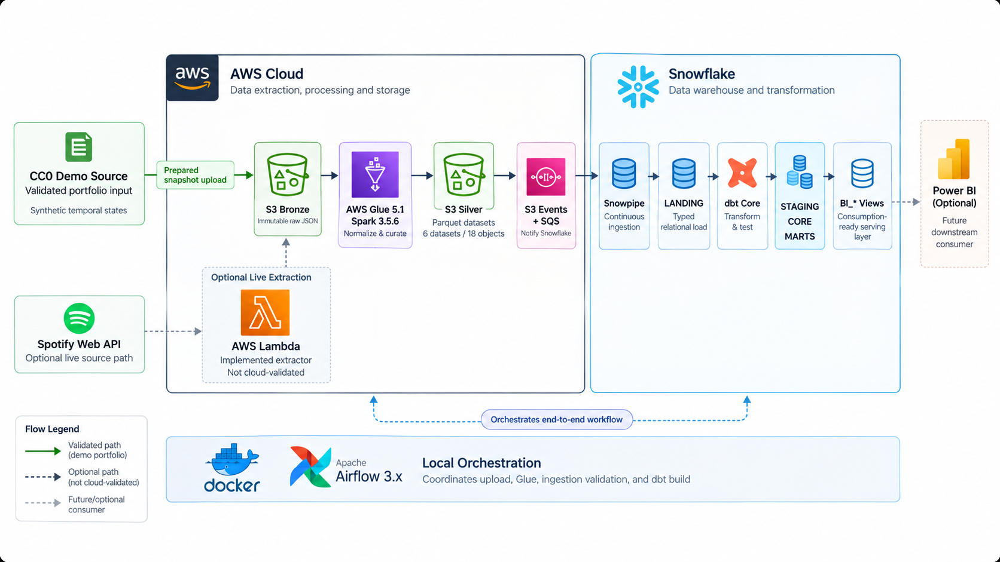
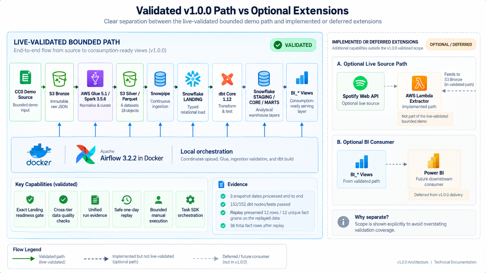
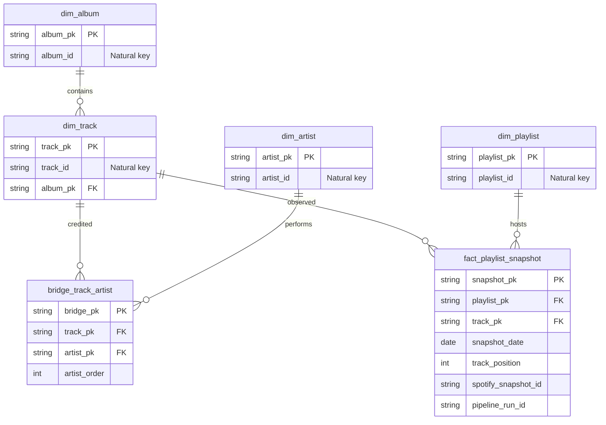

<div align="center">

# Spotify Analytics Data Platform

### A production-oriented data engineering platform for historical playlist analytics

**Apache Airflow 3 · AWS · Glue 5.1 · Spark 3.5.6 · Snowflake · Snowpipe · dbt Core · Terraform · GitHub Actions**

[](https://github.com/DanielBBrasileiro/spotify-analytics-data-platform/actions/workflows/ci.yml)
[](https://github.com/DanielBBrasileiro/spotify-analytics-data-platform/releases/tag/v1.0.0)
[](https://www.python.org/)
[](https://airflow.apache.org/)
[](https://www.getdbt.com/)
[](https://www.terraform.io/)
[](LICENSE)

[Architecture](#architecture-at-a-glance) · [Validated Evidence](#validated-evidence) · [Engineering Highlights](#engineering-highlights) · [Quick Start](#quick-start) · [Documentation](#documentation)

</div>

---

## Executive Summary

The **Spotify Analytics Data Platform** is an end-to-end batch data engineering project built to preserve historical playlist state and turn it into reliable, replayable analytical data.

The platform separates technical curation from analytical modeling: immutable source snapshots land in **Amazon S3 Bronze**, **AWS Glue 5.1 / Apache Spark 3.5.6** normalizes them into typed Parquet datasets in **S3 Silver**, **Snowpipe** loads the warehouse, and **dbt Core 1.12** builds the dimensional model, marts, tests, and BI-serving views in **Snowflake**. **Apache Airflow 3.2.2**, running locally in Docker, coordinates the external boundaries and records run evidence rather than performing heavy data processing itself.

The repository also includes **cross-tier quality gates, replay-safe orchestration, unified run telemetry, incident/recovery tooling, Terraform IaC, security scanning, cost guardrails, CI contracts, and portfolio-grade operational documentation**.

> **Validation boundary:** the reproducible public demo starts from a CC0-backed playlist dataset and uses deterministic **synthetic temporal evolution**. The bounded cloud slice from S3 through Glue, Snowpipe, Snowflake, dbt, Airflow orchestration, and serving views was live-validated. A live Spotify API → Lambda extraction is implemented as a separate source path but is **not** presented as part of that validated demo. Power BI is intentionally outside the v1.0.0 scope.

---

## At a Glance

| | Evidence |
|---|---|
| **Cloud pipeline** | S3 Bronze → Glue 5.1 / Spark → S3 Silver → Snowpipe → Snowflake → dbt |
| **Orchestration** | Airflow 3.2.2 Task SDK, Deadline Alert, structured failure callback, bounded retries |
| **Live validation** | 3 snapshot dates processed end to end, followed by a selective one-day replay |
| **dbt result** | **152 / 152** nodes and tests passed in the validated builds |
| **Replay result** | Replayed date remained **12 rows / 12 unique fact grains**; total fact count remained **36** |
| **Serving** | 4 tested `BI_*` Snowflake views queryable by `SPOTIFY_ANALYST` |
| **IaC & CI** | Terraform + TFLint + Checkov + Python/Spark/Snowflake/dbt/Airflow contracts |
| **Cost design** | Local Airflow, bounded Glue, Snowflake X-Small + auto-suspend, AWS Budget definitions |
| **Release** | [`v1.0.0`](https://github.com/DanielBBrasileiro/spotify-analytics-data-platform/releases/tag/v1.0.0) |

---

## Architecture at a Glance



*Architecture overview. Solid connections describe the bounded CC0-backed cloud demo; the dashed Spotify API/Lambda branch is implemented separately and is not part of its live validation. Power BI is a future optional consumer, not a v1.0.0 deliverable.*

The platform follows a **lake-to-warehouse** architecture with clear execution boundaries. Compute is delegated to the engine best suited to each responsibility, while orchestration, lineage, quality and recovery remain explicit platform concerns.

The target source-side architecture additionally supports **Spotify Web API → AWS Lambda → S3 Bronze**. It remains visually and documentationally separated from the validated CC0 demo so that implementation and live evidence are never conflated.

For the technical deep dive, see [`docs/ARCHITECTURE.md`](docs/ARCHITECTURE.md).

---

## Validated Evidence



*Evidence map for v1.0.0. The three-day CC0-backed cloud workflow and selective replay are distinguished from the separately tested live-source contract and deferred BI consumer. The illustration summarizes recorded validation; it is not a monitoring dashboard.*

This repository deliberately distinguishes **implemented**, **live-validated**, and **deferred** capabilities.

| Capability | Status | Evidence / boundary |
|---|---|---|
| S3 Bronze → Glue 5.1 → S3 Silver | **Live validated** | Three bounded snapshot dates plus one replay; Glue completion manifests captured per physical run. |
| Snowpipe → Snowflake Landing | **Live validated** | Six datasets checked against exact run-scoped filenames and expected row counts. |
| dbt Core models/tests | **Live validated** | 152/152 nodes/tests passed in both the bounded run and replay validation. |
| Incremental replay/idempotency | **Live validated** | One logical date replayed without duplicate fact grains or fact inflation. |
| Snowflake serving layer | **Live validated** | `BI_PLAYLIST_DAILY`, `BI_TRACK_DAILY`, `BI_TRACK_CHANGES`, and `BI_ARTIST_DAILY` queried with `SPOTIFY_ANALYST`. |
| Airflow orchestration | **Live validated** | Bounded DAG completed successfully against AWS Glue, Snowpipe, Snowflake and dbt. |
| Airflow Deadline Alert / structured callback | **Implemented + CI validated** | Airflow 3.2.2 contract loaded by CI; no legacy SLA syntax. |
| Terraform IaC | **Implemented + offline validated** | `fmt`, `init -backend=false`, `validate`, TFLint and Checkov pass; no destructive apply/destroy was performed for v1.0.0. |
| Spotify API → Lambda live extraction | **Implemented source path; not part of validated demo** | Auth/extraction contracts are tested; the public bounded demo starts from CC0 Bronze input. |
| Power BI semantic model/dashboard | **Deferred** | v1.0.0 intentionally ends at tested Snowflake/dbt serving views. |

### Portfolio data boundary

The public demo adapts catalog-style metadata from the CC0-licensed `jeremycte/spotify-10000-songs-dataset`. The three-day playlist membership, positions, snapshot IDs, and compatibility fields are generated deterministically by this repository and tagged with `source_type=cc0_demo` and `temporal_state=synthetic`.

This supports statements such as **“the pipeline computes changes across three simulated snapshots”**. It does not support presenting those changes as observed Spotify history, listening behavior, popularity, or market trends. See [ADR-0009](docs/adr/0009-cc0-source-with-synthetic-temporal-demo.md).

---

## End-to-End Data Flow

<!--
VISUAL ASSET 03
Target: docs/assets/readme/data-layers-flow.png
Prompt: docs/assets/README.md#03--data-layers-flow
When ready:

-->

| Layer | Primary representation | Responsibility | Downstream contract |
|---|---|---|---|
| **Source / Bronze** | Immutable JSON snapshots | Preserve source-shaped input and execution lineage. | Glue reads run-scoped Bronze objects. |
| **Silver** | Snappy Parquet | Enforce technical schema, validate item types, normalize entities and explode arrays. | Completion manifest inventories all physical output files and row counts. |
| **Landing** | Snowflake typed tables | Preserve one-to-one curated ingestion plus file/row audit metadata. | Exact readiness gate must pass before dbt starts. |
| **Staging** | dbt views | Normalize names, types and source semantics. | Stable warehouse-facing interface. |
| **Core** | Kimball dimensions, bridge and fact | Model durable business entities and canonical playlist snapshot grain. | Tested dimensional foundation. |
| **Marts / Serving** | Analytical marts + `BI_*` views | Expose longitudinal playlist, track, artist and change semantics. | Thin BI/analyst consumption contract. |

### Canonical fact grain

```text
(playlist_id, snapshot_date, track_position)
```

The physical `pipeline_run_id` is lineage, **not** part of the analytical key. A replay therefore creates fresh immutable processing evidence while dbt converges on the same logical fact grain.

Detailed schemas and dictionaries live in [`docs/DATA_MODEL.md`](docs/DATA_MODEL.md).

---

## Engineering Highlights

### 1. Orchestration built for safe external execution

<!--
VISUAL ASSET 04
Target: docs/assets/readme/orchestration-dag.png
Prompt: docs/assets/README.md#04--airflow-orchestration-model
When ready:

-->

The Airflow DAG follows this runtime structure:

```text
prepare
  └─ records
      └─ [upload → submit → await_glue → await_landing] per snapshot
                                                       │
                                                       ▼
                                                  transform
                                                       │
                                                       ▼
                                                    report
```

Key reliability decisions:

- **Airflow 3.2.2 Task SDK** (`@dag`, `@task`, `@task.sensor`).
- `schedule=None` by design: the portfolio workflow is manually triggered to keep live runs explicit and bounded.
- `max_active_runs=1` to avoid overlapping bounded demos.
- Safe transient tasks use **3 retries**, a five-minute initial delay and exponential backoff.
- **Glue submission has `retries=0`**. An ambiguous external submission must not be blindly repeated.
- Glue and Landing waits use sensor behavior rather than tight polling loops.
- Airflow 3 **Deadline Alert** replaces legacy SLA semantics.
- Structured `DAG_FAILED` and `DAG_DEADLINE_MISSED` events expose safe execution context without serializing secrets or exception bodies.

See [`airflow/README.md`](airflow/README.md) for the operational contract.

### 2. Cross-tier quality gates

<!--
VISUAL ASSET 05
Target: docs/assets/readme/quality-observability.png
Prompt: docs/assets/README.md#05--data-quality-and-observability-controls
When ready:

-->

A successful upstream service call is **not** treated as proof that downstream data is ready.

The pipeline validates quality at multiple boundaries:

- **Bronze:** valid non-empty source payloads and required snapshot lineage.
- **Silver:** explicit Spark schemas, valid item types, technical normalization and rejected-item accounting.
- **Landing:** exact run-scoped files, expected row totals, distinct `_FILE_ROW_NUMBER` values, no unexpected files and zero rejected demo items.
- **dbt/Core:** uniqueness, relationships, accepted values, grain integrity and serving coverage tests.

The repository exposes the complete gate suite through:

```bash
make check-quality
```

### 3. Evidence-first observability

Each Airflow run produces a small evidence chain under `airflow/artifacts/<run-key>/`:

```text
plan.json
├── glue-<pipeline_run_id>.json
├── landing-<pipeline_run_id>.json
├── dbt-summary.json
├── run-summary.json
└── pipeline-run-report.json      # generated on demand
```

`scripts/generate_run_report.py` consolidates correlation IDs, status, source provenance, extracted/curated/loaded counts, Glue execution metadata, dbt results and component durations into a schema-validated run report. Publication to `metadata/pipeline_runs/` in S3 is explicit and immutable.

See [`docs/OBSERVABILITY.md`](docs/OBSERVABILITY.md).

### 4. Replay without erasing forensic history

A replay creates a **new physical UUID v4** and fresh immutable S3 paths. Existing evidence is not deleted or overwritten. dbt performs logical convergence at the canonical business grain.

```bash
.venv/bin/python scripts/replay_partition.py \
  --date 2026-09-10 \
  --dry-run
```

Execution requires the explicit `--execute` flag. Operational recovery guidance is documented in [`docs/RUNBOOK.md`](docs/RUNBOOK.md).

---

## Technology Stack

| Concern | Technology | Why it is used here |
|---|---|---|
| **Language** | Python 3.12 | Typed platform code, source adapters, orchestration helpers and CLIs. |
| **Source auth** | OAuth 2.0 Authorization Code + refresh token | Supports user-scoped playlist access in the live source architecture. |
| **Source compute** | AWS Lambda | Serverless Python extractor for the optional live Spotify source path. |
| **Raw / curated storage** | Amazon S3 | Immutable Bronze plus columnar Silver and metadata prefixes. |
| **Technical curation** | AWS Glue 5.1 / Spark 3.5.6 | Schema enforcement, semi-structured normalization and Parquet production. |
| **Warehouse ingestion** | Snowpipe | Event-driven ingestion from S3 Silver into Snowflake Landing. |
| **Warehouse** | Snowflake | Landing, dimensional modeling, marts and serving contract. |
| **Analytics engineering** | dbt Core 1.12 | Staging, dimensions, fact, marts, incremental merge and tests. |
| **Orchestration** | Apache Airflow 3.2.2 | Task SDK coordination, sensors, Deadline Alert, evidence and recovery boundaries. |
| **Local runtime** | Docker / Docker Compose | Reproducible Airflow environment without managed-orchestrator baseline cost. |
| **Infrastructure as Code** | Terraform | Version-controlled AWS S3, IAM, Lambda, Glue, monitoring and budget definitions. |
| **CI / security** | GitHub Actions, Ruff, TFLint, Checkov | Code, data-platform and IaC contracts without cloud credentials in CI. |
| **Serving** | Snowflake `MARTS` / `BI_*` views | Tested analytical consumption surface independent of dashboard tooling. |

---

## Analytical Model

The warehouse uses a Kimball-style dimensional core:



Spark and dbt deliberately own different responsibilities:

- **Glue / Spark:** source-shape normalization, technical validation, array explosion, deduplication and Parquet serialization.
- **dbt / Snowflake:** warehouse semantics, surrogate keys, dimensions, canonical fact grain, incremental merge, marts, serving views and business tests.

---

## Serving Layer

<!--
VISUAL ASSET 06
Target: docs/assets/readme/serving-layer.png
Prompt: docs/assets/README.md#06--analytics-serving-layer
When ready:

-->

v1.0.0 ends at a tested Snowflake serving contract rather than coupling the platform to one visualization tool.

| View | Grain | Primary purpose |
|---|---|---|
| `BI_PLAYLIST_DAILY` | playlist + snapshot date | Daily playlist size, duration, entries, exits and turnover. |
| `BI_TRACK_DAILY` | playlist + track + snapshot date | Position and observed-retention behavior by track. |
| `BI_TRACK_CHANGES` | playlist + track + snapshot date/change state | `NEW`, `RETAINED`, `EXITED`, positional movement and streaks. |
| `BI_ARTIST_DAILY` | artist + snapshot date | Artist presence, credited slots, reach and playlist share. |

The contract defines units, null semantics, provenance, relationship guidance, display positions and refresh expectations in [`docs/SERVING_CONTRACT.md`](docs/SERVING_CONTRACT.md).

**Power BI is an optional downstream consumer and is not part of the v1.0.0 implementation claim.**

---

## Infrastructure, CI and Cost Controls

<!--
VISUAL ASSET 07
Target: docs/assets/readme/iac-ci-cost-controls.png
Prompt: docs/assets/README.md#07--infrastructure-as-code-ci-and-cost-controls
When ready:

-->

### Terraform scope

The AWS Terraform root defines:

- private, versioned and SSE-S3-encrypted lake storage;
- least-privilege Lambda, Glue and Snowflake integration IAM roles;
- Python 3.12 Lambda extraction shape;
- Glue 5.1 Spark job shape;
- seven-day CloudWatch log retention;
- configurable **USD 20/month** AWS Budget notifications at 50% and 90% for actual and forecast spend.

The Terraform code was validated with `terraform fmt`, `init -backend=false`, `validate`, **TFLint**, and **Checkov**. The existing manually validated cloud slice was intentionally preserved; v1.0.0 does **not** claim that the live environment is already owned by a Terraform state or that an apply/destroy cycle was executed.

### CI pipeline

Every pull request and `main` push validates six independent concerns:

```text
Terraform checks
Lint & Test (Python 3.12)
Spark Contracts (Glue 5.1 parity)
Snowflake SQL Contracts
dbt Parse Contracts
Airflow DAG and service contracts
```

The v1.0.0 release was cut from a green `main` build.

### Cost strategy

The **USD 20/month** figure is a planning target, not a provider-side hard stop. The architecture controls cost structurally:

- Airflow runs locally rather than on MWAA.
- No always-on EC2, EMR or Kubernetes compute is required.
- The Terraform shape avoids a NAT Gateway for Lambda.
- Glue uses bounded worker count/concurrency and timeout controls.
- Snowflake uses an **X-Small** warehouse with 60-second auto-suspend and a resource monitor.
- The live validation recorded **589 DPU-seconds** across four successful Glue runs.
- The Snowflake resource monitor showed **0.45 cumulative credits used** after final bounded validation and replay; this is not presented as isolated per-run dollar cost.
- A manually created **USD 5 AWS Budget** protected the live demo account, while Terraform codifies the reusable USD 20 portfolio budget contract.

See [`docs/COST_STRATEGY.md`](docs/COST_STRATEGY.md) for the evidence boundary and operating controls.

---

## Key Architectural Decisions

The project records non-trivial decisions as ADRs rather than burying rationale in implementation details.

| Decision | Rationale |
|---|---|
| [Airflow orchestrates; compute stays external](docs/adr/0001-airflow-as-orchestrator.md) | Keeps worker memory out of data-processing responsibilities and makes service boundaries explicit. |
| [S3 Bronze is durable and immutable](docs/adr/0002-s3-as-durable-landing-zone.md) | Enables replay, lineage and forensic inspection without source re-fetch. |
| [Parquet is the Silver contract](docs/adr/0003-parquet-for-curated-data.md) | Columnar typed storage is efficient for Snowpipe/Snowflake ingestion. |
| [Snowflake owns analytical warehousing](docs/adr/0004-snowflake-as-analytical-warehouse.md) | Separates analytical compute from lake curation and supports aggressive auto-suspend. |
| [Spark and dbt have separate jobs](docs/adr/0005-separate-spark-and-dbt-responsibilities.md) | Spark handles source-shape work; dbt owns warehouse/business semantics. |
| [Historical snapshots use a stable logical grain](docs/adr/0006-historical-playlist-snapshots.md) | Physical retries do not create new business facts. |
| [Authorization Code + refresh token](docs/adr/0007-spotify-authorization-code-and-refresh-token.md) | Matches the user-scoped scheduled source design. |
| [CC0 source + synthetic temporal demo](docs/adr/0009-cc0-source-with-synthetic-temporal-demo.md) | Makes the public demo reproducible without overstating Spotify-derived history. |

---

## Repository Structure

```text
.
├── airflow/                 # Airflow 3.2.2 DAG, Docker runtime and service adapters
├── dbt/                     # Staging, core, marts, serving views and dbt tests
├── docs/                    # Architecture, data model, operations, ADRs and portfolio guides
│   ├── adr/                 # Architecture Decision Records
│   └── assets/              # Premium documentation visuals and generation briefs
├── glue/                    # Glue 5.1 / Spark transformation and completion manifest logic
├── infra/terraform/         # Modular AWS IaC, monitoring and budget controls
├── lambda/                  # Spotify API extractor runtime
├── scripts/                 # Demo generation, replay, telemetry and operational CLIs
├── snowflake/               # DDL, Snowpipe, RBAC and validation SQL
├── src/                     # Core Python package
├── tests/                   # Python, Spark, Snowflake, dbt and orchestration contracts
├── BACKLOG.md               # Completed milestone history and scope decisions
├── Makefile                 # Local validation and orchestration commands
└── README.md                # Portfolio entry point
```

---

## Quick Start

### Prerequisites

- Python 3.12+
- Git
- Docker + Docker Compose for local Airflow
- Python 3.11 + Java 17 for Glue/Spark parity tests
- Terraform/TFLint/Checkov only when reproducing local IaC validation

### Local Python setup

```bash
git clone https://github.com/DanielBBrasileiro/spotify-analytics-data-platform.git
cd spotify-analytics-data-platform
make setup
make check
```

No Spotify, AWS or Snowflake credentials are required for the default offline Python validation path.

### Cross-tier quality contracts

Once the dedicated Airflow, Spark and dbt environments are prepared:

```bash
export JAVA_HOME=/path/to/java-17
make check-quality
```

### Local Airflow

```bash
cp airflow/.env.example airflow/.env
# Configure local integration values without committing secrets.
make airflow-up
```

Then follow [`airflow/README.md`](airflow/README.md). The default Compose UI binds to `localhost:8080`; the port can be overridden locally when another environment already occupies it.

> Never commit `.env`, private keys, refresh tokens, Snowflake passwords, or temporary AWS credentials. See [`docs/SECURITY.md`](docs/SECURITY.md).

---

## Documentation

| Document | Use it for |
|---|---|
| [`docs/ARCHITECTURE.md`](docs/ARCHITECTURE.md) | System design, execution sequence and component responsibilities. |
| [`docs/DATA_MODEL.md`](docs/DATA_MODEL.md) | Landing, staging, core, marts, grain and data dictionaries. |
| [`docs/SERVING_CONTRACT.md`](docs/SERVING_CONTRACT.md) | BI-facing views, units, null semantics and consumption rules. |
| [`docs/OBSERVABILITY.md`](docs/OBSERVABILITY.md) | Correlation IDs, evidence files, unified run-report schema and telemetry boundary. |
| [`docs/RUNBOOK.md`](docs/RUNBOOK.md) | Incident triage, safe replay, Landing lag inspection and recovery. |
| [`docs/COST_STRATEGY.md`](docs/COST_STRATEGY.md) | Cloud-cost controls, measured evidence and budget governance. |
| [`docs/SECURITY.md`](docs/SECURITY.md) | OAuth lifecycle, secrets hygiene, IAM and Snowflake RBAC. |
| [`airflow/README.md`](airflow/README.md) | Local Airflow runtime, trigger/replay semantics and quality gates. |
| [`infra/terraform/README.md`](infra/terraform/README.md) | AWS IaC scope, validation and deployment boundary. |
| [`docs/DEMO_GUIDE.md`](docs/DEMO_GUIDE.md) | A 5–8 minute portfolio walkthrough grounded in real evidence. |
| [`docs/INTERVIEW_GUIDE.md`](docs/INTERVIEW_GUIDE.md) | Technical talking points and architecture trade-offs for interviews. |
| [`docs/assets/README.md`](docs/assets/README.md) | Visual production brief and detailed prompts for every planned diagram. |
| [`BACKLOG.md`](BACKLOG.md) | Completed milestones, issue history and explicit scope decisions. |

---

## Release Scope: v1.0.0

### Included

- Python 3.12 platform code and source contracts
- S3 Bronze / Silver architecture
- Glue 5.1 / Spark 3.5.6 curation
- Snowpipe / Snowflake Landing
- dbt staging, core, marts and serving views
- Airflow 3.2.2 orchestration with reliability controls
- Cross-tier data quality
- Run evidence and unified telemetry reporting
- Safe replay and Landing-lag inspection tools
- Modular AWS Terraform and CI security validation
- Cost controls, runbook, demo and interview documentation

### Deliberately outside this release

- A claim that the bounded demo performed a live Spotify Lambda extraction
- Managed Airflow / AWS MWAA
- 24/7 production alerting or managed APM
- Power BI semantic model, DAX, `.pbit`, or dashboard assets
- A destructive Terraform apply/destroy demonstration against the validated live environment

These boundaries are design decisions, not hidden gaps. They keep the public claims aligned with verifiable evidence.

---

## Portfolio / Interview Entry Points

If you are reviewing this repository for a data engineering role, the fastest route is:

1. **Architecture:** [`docs/ARCHITECTURE.md`](docs/ARCHITECTURE.md)
2. **Run evidence:** [`docs/OBSERVABILITY.md`](docs/OBSERVABILITY.md)
3. **Data model:** [`docs/DATA_MODEL.md`](docs/DATA_MODEL.md)
4. **Orchestration / replay safety:** [`airflow/README.md`](airflow/README.md)
5. **Infrastructure / CI:** [`infra/terraform/README.md`](infra/terraform/README.md)
6. **Demo script:** [`docs/DEMO_GUIDE.md`](docs/DEMO_GUIDE.md)
7. **Technical discussion guide:** [`docs/INTERVIEW_GUIDE.md`](docs/INTERVIEW_GUIDE.md)

---

## License

Licensed under the [MIT License](LICENSE).
