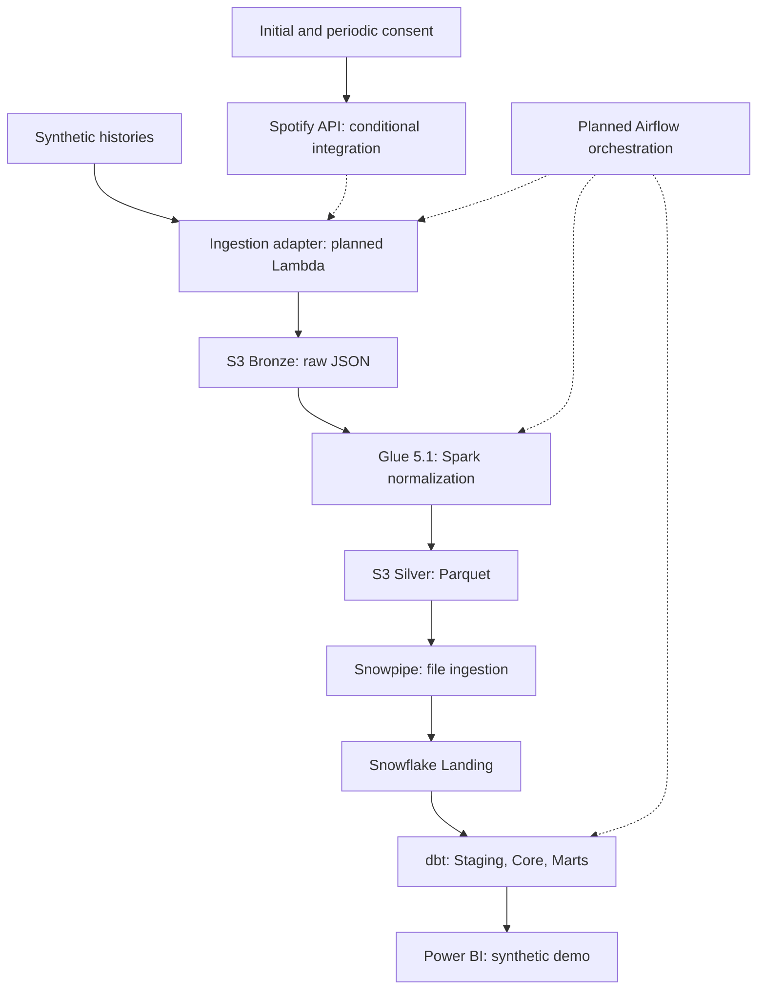

# Spotify Analytics Data Platform

[](https://github.com/DanielBBrasileiro/spotify-analytics-data-platform/actions/workflows/ci.yml)
[](https://opensource.org/licenses/MIT)
[](https://www.python.org/downloads/release/python-3120/)
[](https://github.com/astral-sh/ruff)
[](https://github.com/DanielBBrasileiro/spotify-analytics-data-platform/releases/tag/v0.1.1)

> Data Engineering portfolio with an offline-tested Spotify API client and a planned AWS/Snowflake analytics pipeline demonstrated with fully synthetic playlist histories. The design covers lineage, replay, Spark/dbt boundaries, orchestration, and cost governance.

---

### Project Status: M1 — Local Ingestion Complete

| Component | Verified repository state |
| --- | --- |
| OAuth refresh client | Implemented in PR #38; initial browser consent is external |
| Paginated extractor | Implemented in PR #39; optimistic source-version checks |
| Synthetic fixtures and opt-in parser | Implemented in PR #41 |
| Run metadata and local Bronze persistence | Implemented in PR #44; validated Pydantic lineage and immutable local writer |
| Lambda, S3, Glue, Snowflake, dbt, Airflow, Terraform, Power BI | Planned; component directories contain design READMEs only |

**Demo data:** portfolio analytics and future dashboards use fully synthetic
histories. Live analytical use of Spotify data remains unresolved under the
developer policy; OAuth consent alone is insufficient. See
[ADR-0008](docs/adr/0008-synthetic-analytics-and-source-use-boundary.md).
The API integration below is a conditional target architecture, not the demo's
data source. A synthetic end-to-end runner has not yet been implemented.

> **Implemented:** M1 now includes refresh-token authentication, paginated/version-checked extraction, synthetic fixtures/parser contracts, validated run metadata, and local immutable Bronze persistence. CI enforces lint, formatting, and at least 91% statement/branch coverage overall. Live Spotify access and the cloud pipeline have not been validated by these tests. The latest tagged release remains **v0.1.1**; cloud work starts in M2 and follows [BACKLOG.md](BACKLOG.md).

---

## 1. Target Architecture Overview

The target lakehouse-to-warehouse architecture delegates work to specialized engines. Planned Airflow orchestration coordinates scheduling and dependencies. Cloud resources, analytical transformations, and BI outputs have not been implemented or deployed by this repository.



---

## 2. Business & Analytical Problem

Music streaming metadata undergoes continuous changes as tracks enter, shift positions, and exit playlists. However, typical educational ETL pipelines suffer from fundamental design flaws:
- **State Overwriting**: Overwriting playlist state daily destroys historical track movements.
- **Missing Retention Metrics**: Unable to calculate how many consecutive days a track stays on a playlist.
- **Unverified API Assumptions**: Relying on deprecated endpoints (`/tracks`) or removed popularity fields.

### What the Synthetic Demonstration Will Explore
The planned analytical models use **fully invented playlist histories** to demonstrate the following metrics. Future real API integration is restricted to owner/collaborator access and requires a separately established permitted use:
1. **Track Lifecycle & Churn**: First/last observed presence and retention across captured daily observations; daily snapshots do not reveal unobserved intra-day changes.
2. **Positional Dynamics**: Daily rank movement, best position achieved, and average position.
3. **Artist Representation & Concentration**: Which artists occupy the greatest playlist share over time.
4. **Playlist Volatility**: Quantifying turnover rates (daily additions vs. exits) across monitored playlists.
5. **Catalog Composition Trends**: Longitudinal evolution of explicit content share, duration distribution, and release recency.

---

## 3. Technology Stack

| Layer | Technology | Architectural Rationale |
| :--- | :--- | :--- |
| **Language** | Python 3.12 | Local package and CI runtime; the implemented HTTP client uses the standard library. |
| **Authentication** | OAuth 2.0 Auth Code + Refresh Token | User identity for owner/collaborator items access; periodic reauthorization and source-use limits apply. |
| **Orchestration** | Apache Airflow 3.x | Planned >=3.1,<4 target for Task SDK and Deadline Alerts; exact version/providers will be pinned in M6. |
| **Extraction** | AWS Lambda | Planned serverless adapter reusing the existing client; execution duration and total deadline remain unvalidated. |
| **Data Lake** | Amazon S3 | Tiered storage: raw immutable JSON in Bronze, columnar Snappy-compressed Parquet in Silver. |
| **Lake Processing** | AWS Glue 5.1 / PySpark | Managed Spark 3.5.6 / Python 3.11 for unnesting semi-structured items and schema enforcement. |
| **Ingestion** | Snowflake Snowpipe | Serverless, continuous micro-batch loading from S3 into Landing tables with file audit metadata. |
| **Data Warehouse** | Snowflake | Columnar analytical warehouse with `X-Small` warehouse and 60-second auto-suspend. |
| **Transformation** | dbt Core | SQL dimensional modeling, surrogate key hashing, incremental `MERGE`, and data testing. |
| **Infrastructure as Code** | Terraform | Reproducible, version-controlled cloud infrastructure across AWS and Snowflake. |
| **CI/CD** | GitHub Actions | Automated linting (`ruff`), formatting verification, and unit testing (`pytest`) on every PR. |
| **Business Intelligence** | Power BI | Star schema analytical reporting, interactive churn dashboards, and tenure metrics. |

---

## 4. Key Architectural Decisions

The platform's engineering design is formalized through **Architecture Decision Records (ADRs)** in [`docs/adr/`](docs/adr/):

- **[ADR-0001: Airflow as Orchestrator, Not Execution Engine](docs/adr/0001-airflow-as-orchestrator.md)**: Airflow never processes data in worker memory. Compute is delegated to Lambda, Glue 5.1, and Snowflake.
- **[ADR-0002: S3 Bronze as Durable Immutable Landing Layer](docs/adr/0002-s3-as-durable-landing-zone.md)**: Preserves raw API responses under deterministic partitions (`ingestion_date=YYYY-MM-DD/run_id=<id>/`) enabling full replayability.
- **[ADR-0003: Apache Parquet for Curated Data](docs/adr/0003-parquet-for-curated-data.md)**: Planned Snappy-compressed columnar format; storage savings and loading performance require measurement.
- **[ADR-0004: Snowflake as Central Analytical Warehouse](docs/adr/0004-snowflake-as-analytical-warehouse.md)**: Planned compute sizing and 60-second auto-suspension to reduce idle costs.
- **[ADR-0005: Separate Spark and dbt Responsibilities](docs/adr/0005-separate-spark-and-dbt-responsibilities.md)**: Spark handles semi-structured array explosion; dbt handles modular SQL dimensional modeling.
- **[ADR-0006: Historical Playlist Snapshots](docs/adr/0006-historical-playlist-snapshots.md)**: Pinned to canonical daily grain `(playlist_id + snapshot_date + track_position)` with `spotify_snapshot_id` lineage.
- **[ADR-0007: Spotify Authorization Code & Refresh Token](docs/adr/0007-spotify-authorization-code-and-refresh-token.md)**: Initial consent plus periodic reauthorization; refresh-token rotation is currently process-local.
- **[ADR-0008: Synthetic Analytics and Source Use](docs/adr/0008-synthetic-analytics-and-source-use-boundary.md)**: Defines the synthetic portfolio scope and unresolved live analytical use.

---

## 5. Spark vs. dbt Responsibilities

```
Raw JSON (Bronze S3)
       │
       ▼ [AWS Glue 5.1 / PySpark 3.5.6] -> Parse items, validate tracks, explode artists
Curated Parquet (Silver S3)
       │
       ▼ [Snowpipe] -> Automated Ingestion + Metadata Lineage
Landing Tables (Snowflake)
       │
       ▼ [dbt Core] -> Dimensional Modeling & Incremental Merge
Core Star Schema & Marts (Snowflake)
```

- **AWS Glue 5.1 / PySpark**: Unpacks raw JSON items, validates item types, enforces explicit StructType schemas, handles technical deduplication, and serializes Snappy Parquet.
- **dbt Core**: Generates surrogate keys, maintains dimensions (`dim_track`, `dim_artist`, `dim_album`), manages `bridge_track_artist`, merges `fact_playlist_snapshot` on `snapshot_pk`, and builds analytical marts.

---

## 6. Planned Snowflake Dimensional Model

```mermaid
erDiagram
    dim_track ||--o{ bridge_track_artist : "has"
    dim_artist ||--o{ bridge_track_artist : "credited"
    dim_album ||--o{ dim_track : "contains"
    dim_track ||--o{ fact_playlist_snapshot : "observed at slot"
    dim_playlist ||--o{ fact_playlist_snapshot : "hosts slot"

    dim_track {
        string track_pk PK
        string track_id "Natural key"
        string track_name
        int duration_ms
        boolean is_explicit
    }

    dim_artist {
        string artist_pk PK
        string artist_id "Natural key"
        string artist_name
    }

    dim_album {
        string album_pk PK
        string album_id "Natural key"
        string album_name
        date release_date
        int total_tracks
    }

    dim_playlist {
        string playlist_pk PK
        string playlist_id "Natural key"
        string playlist_name
    }

    bridge_track_artist {
        string bridge_pk PK
        string track_pk FK
        string artist_pk FK
        int artist_order
    }

    fact_playlist_snapshot {
        string snapshot_pk PK
        string playlist_pk FK
        string track_pk FK
        date snapshot_date
        int track_position
        string spotify_snapshot_id
        timestamp snapshot_timestamp
        timestamp added_at
        string pipeline_run_id
    }
```



Detailed schema definitions, canonical grain evaluations, and data dictionaries are documented in [`docs/DATA_MODEL.md`](docs/DATA_MODEL.md).

---

## 7. Cost Governance ($20/Month Portfolio Budget Target)

The **USD 20/month** figure is an operational planning target, not a hard spending
cap. No billing evidence or enforced cloud controls are established by this repo.

Planned controls include local Airflow, on-demand Glue, an X-Small Snowflake
warehouse with `AUTO_SUSPEND = 60`, seven-day log retention, and budget alerts.
Actual costs depend on workload, retries, storage, region, account eligibility,
and serverless charges. Teardown requires resource and billing verification.

See [Cost Strategy](docs/COST_STRATEGY.md) for assumptions and implementation status.

---

## 8. Repository Structure

Component directory descriptions below indicate intended scope. Only `src/`,
`tests/`, local tooling, and CI currently contain executable implementation.

```
.
├── .github/
│   ├── ISSUE_TEMPLATE/       # Structured GitHub issue templates (bug & feature)
│   ├── workflows/            # GitHub Actions CI pipeline
│   └── pull_request_template.md
│
├── docs/                     # Comprehensive engineering documentation
│   ├── PROJECT_BLUEPRINT.md  # Master 47-section technical specification (v0.1.1)
│   ├── COST_STRATEGY.md      # Budget limits, cost drivers, and teardown runbook
│   ├── ARCHITECTURE.md       # High-level architecture and sequence diagrams
│   ├── DATA_MODEL.md         # Schema dictionaries, dimensional model, canonical keys
│   ├── SECURITY.md           # OAuth 2.0 token lifecycle, IAM least privilege, RBAC
│   ├── OBSERVABILITY.md      # Structured telemetry schema (pipeline_run_id & snapshot_id)
│   ├── RUNBOOK.md            # Incident triage playbooks and backfill procedures
│   ├── REFERENCES.md         # Source restrictions, runtime references, and review dates
│   └── adr/                  # Architectural Decision Records (ADR 0001 - 0008)
│
├── src/
│   └── spotify_data_platform/# Core Python package
│
├── tests/
│   └── unit/                 # Unit test suite (pytest)
│
├── airflow/                  # Airflow 3.x DAGs, Docker Compose, and Task SDK
├── lambda/                   # Serverless Spotify API extractor handler
├── glue/                     # AWS Glue 5.1 PySpark scripts and explicit schemas
├── dbt/                      # dbt Core project (staging, core, marts, tests)
├── snowflake/                # Snowflake DDL, Snowpipe, and RBAC manifests
├── infra/terraform/          # Infrastructure as Code modules (S3, IAM, Lambda, Glue)
├── powerbi/                  # Semantic models, DAX measures, and dashboard templates
├── scripts/                  # Developer utilities and mock data generators
│
├── .editorconfig             # Standardized cross-editor formatting rules
├── .env.example              # Template environment variables (no credentials)
├── .geminiignore             # Gemini CLI security and noise filters
├── .gitignore                # Git exclusion rules
├── BACKLOG.md                # Phased engineering roadmap across milestones M0 - M9
├── CONTRIBUTING.md           # Contribution guidelines, branching, and commit conventions
├── GEMINI.md                 # Repository-level Gemini CLI operational guidelines
├── LICENSE                   # MIT Open Source License
├── Makefile                  # Local automation commands (lint, test, format, check)
├── pyproject.toml            # Python packaging and tool configuration (Ruff, pytest)
└── README.md
```

---

## 9. Local Development Setup

### Prerequisites
- Python 3.12+ (managed via `pyenv` or `asdf`)
- Git & GitHub CLI (`gh`)
- Docker & Docker Compose will be needed for M6 Airflow; neither is required for the current offline suite.
- Glue 5.1 will use a separate Python 3.11 / Spark 3.5.6 environment. The Python >=3.12 ingestion package is not installable unchanged into that runtime.

### Quick Start
1. **Clone the repository**:
   ```bash
   git clone https://github.com/DanielBBrasileiro/spotify-analytics-data-platform.git
   cd spotify-analytics-data-platform
   ```

2. **Initialize virtual environment & install dev dependencies**:
   ```bash
   make setup
   ```

3. **Optional integration configuration** (unnecessary for offline tests; see ADR-0008 before live use):
   ```bash
   cp .env.example .env
   # Keep placeholders; the client reads process environment, not .env automatically
   ```

4. **Run static analysis and tests**:
   ```bash
   make check
   ```

### Makefile Commands
- `make setup`: Creates `.venv` and installs dependencies in editable mode with development packages.
- `make lint`: Runs Ruff linter (`ruff check .`).
- `make format`: Formats code using Ruff (`ruff format .`).
- `make format-check`: Verifies code formatting without writing changes.
- `make test`: Runs unit tests via `pytest`.
- `make check`: Executes `lint`, `format-check`, and `test` sequentially.
- `make clean`: Removes Python build artifacts, `.pyc` files, and test caches.

---

## 10. Phased Implementation Roadmap

- [x] **Milestone M0 — Project Foundation & Architecture Blueprint** (Completed & Revised in v0.1.1)
- [x] **Milestone M1 — Local Spotify Ingestion** (Auth Code client, pagination, fixtures/parser tests, run metadata, local Bronze persistence)
- [ ] **Milestone M2 — AWS Lambda & Bronze Data Lake** (Serverless extractor, S3 Bronze, Secrets Manager)
- [ ] **Milestone M3 — Glue / PySpark & Silver Layer** (Glue 5.1, StructType schemas, array explosion, Parquet)
- [ ] **Milestone M4 — Snowflake & Snowpipe** (Storage integration, Snowpipe auto-ingest, Landing tables)
- [ ] **Milestone M5 — dbt Analytics Engineering** (Staging views, Kimball star schema, incremental merge facts)
- [ ] **Milestone M6 — Airflow Orchestration** (Airflow 3.x Task SDK, Deadline Alerts, external operators)
- [ ] **Milestone M7 — Data Quality & Observability** (Cross-tier gates, telemetry manifests, incident playbooks)
- [ ] **Milestone M8 — Terraform & CI/CD Hardening** (Terraform modules, CI security, AWS Budgets)
- [ ] **Milestone M9 — Power BI & Portfolio Release** (Semantic model, dashboard visuals, v1.0.0 release)

Refer to [BACKLOG.md](BACKLOG.md) for detailed issues, user stories, and acceptance criteria.

---

## 11. License

This project is licensed under the MIT License — see the [LICENSE](LICENSE) file for details.
