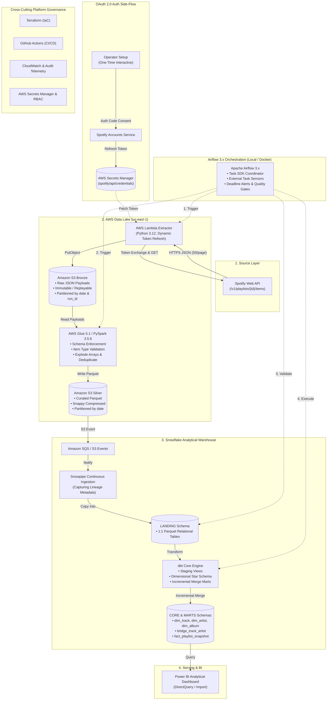
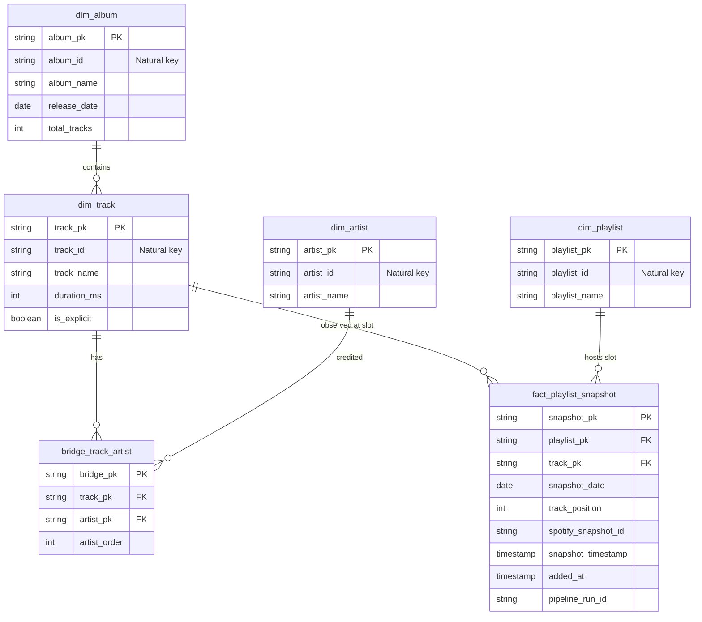

# Spotify Analytics Data Platform

[](https://github.com/DanielBBrasileiro/spotify-analytics-data-platform/actions/workflows/ci.yml)
[](https://opensource.org/licenses/MIT)
[](https://www.python.org/downloads/release/python-3120/)
[](https://github.com/astral-sh/ruff)
[](https://github.com/DanielBBrasileiro/spotify-analytics-data-platform/releases/tag/v0.1.1)

> Production-oriented data engineering platform that ingests historical Spotify playlist snapshots using AWS Lambda, S3, Glue 5.1/PySpark, Snowflake, dbt Core, and Apache Airflow 3.x, with infrastructure as code, CI/CD, cross-tier data quality, and business intelligence in Power BI.

---

### Project Status: M3 Complete — M4/M5 Contracts Prepared Offline
> **Implemented and offline-validated:** M0-M3 plus the code-first portions of M4/M5. This includes Glue 5.1 parity on Spark 3.5.6/Python 3.11, explicit Bronze/Silver schemas, deterministic Parquet contracts, Snowflake topology/RBAC/Storage Integration/Snowpipe/Landing DDL, and a pinned dbt project with staging views, incremental Kimball dimensions/bridge/fact, four analytical marts, generic tests, and singular quality assertions. No real Snowflake object, AWS IAM trust, S3 notification, Snowpipe delivery, or live `dbt build` is claimed yet. Cloud execution remains deliberately deferred to preserve trial/promotional credits, and portfolio analytical datasets remain synthetic unless permitted usage is established separately.

---

## 1. Architecture Overview

The platform implements a decoupled lakehouse-to-warehouse architecture where compute workloads are delegated to specialized engines while Apache Airflow 3.x strictly coordinates scheduling, dependency management, and quality assertions.



---

## 2. Business & Analytical Problem

Music streaming metadata undergoes continuous changes as tracks enter, shift positions, and exit playlists. However, typical educational ETL pipelines suffer from fundamental design flaws:
- **State Overwriting**: Overwriting playlist state daily destroys historical track movements.
- **Missing Retention Metrics**: Unable to calculate how many consecutive days a track stays on a playlist.
- **Unverified API Assumptions**: Relying on deprecated endpoints (`/tracks`) or removed popularity fields.

### What This Platform Answers
By persisting immutable daily snapshots of **monitored user-owned or collaborative playlists accessible under authorized Spotify application scopes**, this platform provides deep longitudinal analysis:
1. **Track Lifecycle & Churn**: Exact entry date, exit date, and retention tenure (days present).
2. **Positional Dynamics**: Daily rank movement, best position achieved, and average position.
3. **Artist Representation & Concentration**: Which artists occupy the greatest playlist share over time.
4. **Playlist Volatility**: Quantifying turnover rates (daily additions vs. exits) across monitored playlists.
5. **Catalog Composition Trends**: Longitudinal evolution of explicit content share, duration distribution, and release recency.

---

## 3. Technology Stack

| Layer | Technology | Architectural Rationale |
| :--- | :--- | :--- |
| **Language** | Python 3.12 | Modern runtime, native typing, robust SDKs (`boto3`, `requests`). |
| **Authentication** | OAuth 2.0 Auth Code + Refresh Token | Complies with 2026 Spotify Development Mode restrictions for user-scoped playlist access. |
| **Orchestration** | Apache Airflow 3.x | Task SDK (`airflow.sdk`) authoring, service-oriented execution, and Deadline Alerts. |
| **Extraction** | AWS Lambda | Ephemeral serverless execution (< 30s); token refresh and paginated `/items` ingestion. |
| **Data Lake** | Amazon S3 | Tiered storage: raw immutable JSON in Bronze, columnar Snappy-compressed Parquet in Silver. |
| **Lake Processing** | AWS Glue 5.1 / PySpark | Managed Spark 3.5.6 / Python 3.11 for unnesting semi-structured items and schema enforcement. |
| **Ingestion** | Snowflake Snowpipe | Serverless, continuous micro-batch loading from S3 into Landing tables with file audit metadata. |
| **Data Warehouse** | Snowflake | Columnar analytical warehouse with `X-Small` warehouse and 60-second auto-suspend. |
| **Transformation** | dbt Core | SQL dimensional modeling, surrogate key hashing, incremental `MERGE`, and data testing. |
| **Infrastructure as Code** | Terraform | Reproducible, version-controlled cloud infrastructure across AWS and Snowflake. |
| **CI/CD** | GitHub Actions | Automated linting (`ruff`), formatting verification, and unit testing (`pytest`) on every PR. |
| **Business Intelligence** | Power BI | Star schema analytical reporting, interactive churn dashboards, and tenure metrics. |

---

## 4. Key Architectural Decisions

The platform's engineering design is formalized through **Architecture Decision Records (ADRs)** in [`docs/adr/`](docs/adr/):

- **[ADR-0001: Airflow as Orchestrator, Not Execution Engine](docs/adr/0001-airflow-as-orchestrator.md)**: Airflow never processes data in worker memory. Compute is delegated to Lambda, Glue 5.1, and Snowflake.
- **[ADR-0002: S3 Bronze as Durable Immutable Landing Layer](docs/adr/0002-s3-as-durable-landing-zone.md)**: Preserves raw API responses under deterministic partitions (`ingestion_date=YYYY-MM-DD/run_id=<id>/`) enabling full replayability.
- **[ADR-0003: Apache Parquet for Curated Data](docs/adr/0003-parquet-for-curated-data.md)**: Snappy-compressed columnar format provides up to 75% storage savings and accelerates warehouse loading.
- **[ADR-0004: Snowflake as Central Analytical Warehouse](docs/adr/0004-snowflake-as-analytical-warehouse.md)**: Elastic compute scaling with automated 60-second auto-suspension to strictly control costs.
- **[ADR-0005: Separate Spark and dbt Responsibilities](docs/adr/0005-separate-spark-and-dbt-responsibilities.md)**: Spark handles semi-structured array explosion; dbt handles modular SQL dimensional modeling.
- **[ADR-0006: Historical Playlist Snapshots](docs/adr/0006-historical-playlist-snapshots.md)**: Pinned to canonical daily grain `(playlist_id + snapshot_date + track_position)` with `spotify_snapshot_id` lineage.
- **[ADR-0007: Spotify Authorization Code & Refresh Token](docs/adr/0007-spotify-authorization-code-and-refresh-token.md)**: Replaces Client Credentials with two-phase Auth Code + stored refresh token for scheduled ingestion.

---

## 5. Spark vs. dbt Responsibilities

```
Raw JSON (Bronze S3)
       │
       ▼ [AWS Glue 5.1 / PySpark 3.5.6] -> Parse items, validate tracks, explode artists
Curated Parquet (Silver S3)
       │
       ▼ [Snowpipe] -> Automated Ingestion + Metadata Lineage
Landing Tables (Snowflake)
       │
       ▼ [dbt Core] -> Dimensional Modeling & Incremental Merge
Core Star Schema & Marts (Snowflake)
```

- **AWS Glue 5.1 / PySpark**: Unpacks raw JSON items, validates item types, enforces explicit StructType schemas, handles technical deduplication, and serializes Snappy Parquet.
- **dbt Core**: Generates surrogate keys, maintains dimensions (`dim_track`, `dim_artist`, `dim_album`), manages `bridge_track_artist`, merges `fact_playlist_snapshot` on `snapshot_pk`, and builds analytical marts.

---

## 6. Planned Snowflake Dimensional Model



Detailed schema definitions, canonical grain evaluations, and data dictionaries are documented in [`docs/DATA_MODEL.md`](docs/DATA_MODEL.md).

---

## 7. Cost Governance ($20/Month Portfolio Budget Target)

To ensure this portfolio project can be run and demonstrated economically, the architecture operates under a strict budget ceiling:

| Metric | Budget Target | Governance Type | Notes |
| :--- | :--- | :--- | :--- |
| **Monthly Ceiling** | **≤ $20.00 USD / month** | **Operational Target & Alert Threshold** | Monitored via AWS Budgets and Snowflake Resource Monitors. |
| **Idle Cost** | **$0.00 - $2.00 / month** | Estimated Range | Zero always-on EC2 instances, EMR clusters, or NAT Gateways. |
| **Single Run Cost** | **< $0.25 USD / run** | Estimated Execution Cost | Ephemeral Lambda (< 30s), Glue 5.1 job (~2 min), Snowflake `X-Small` warehouse. |

Key cost control mechanisms:
- **Snowflake**: Virtual warehouse configured as `X-Small` with `AUTO_SUSPEND = 60` seconds and `AUTO_RESUME = TRUE`.
- **Airflow**: Runs locally in Docker Compose during development, eliminating AWS MWAA fees (~$350/month base).
- **Log Retention**: CloudWatch logs expire after 7 days.
- **Teardown**: All cloud resources are managed via Terraform and can be destroyed instantly (`terraform destroy`).

Full budget breakdown available in [`docs/COST_STRATEGY.md`](docs/COST_STRATEGY.md).

---

## 8. Repository Structure

```
.
├── .github/
│   ├── ISSUE_TEMPLATE/       # Structured GitHub issue templates (bug & feature)
│   ├── workflows/            # GitHub Actions CI pipeline
│   └── pull_request_template.md
│
├── docs/                     # Comprehensive engineering documentation
│   ├── PROJECT_BLUEPRINT.md  # Master 47-section technical specification (v0.1.1)
│   ├── COST_STRATEGY.md      # Budget limits, cost drivers, and teardown runbook
│   ├── ARCHITECTURE.md       # High-level architecture and sequence diagrams
│   ├── DATA_MODEL.md         # Schema dictionaries, dimensional model, canonical keys
│   ├── SECURITY.md           # OAuth 2.0 token lifecycle, IAM least privilege, RBAC
│   ├── OBSERVABILITY.md      # Structured telemetry schema (pipeline_run_id & snapshot_id)
│   ├── RUNBOOK.md            # Incident triage playbooks and backfill procedures
│   ├── REFERENCES.md         # Official 2026 API, Glue 5.1, and Airflow 3 citations
│   └── adr/                  # Architectural Decision Records (ADR 0001 - 0007)
│
├── src/
│   └── spotify_data_platform/# Core Python package
│
├── tests/
│   └── unit/                 # Unit test suite (pytest)
│
├── airflow/                  # Airflow 3.x DAGs, Docker Compose, and Task SDK
├── lambda/                   # Serverless Spotify API extractor handler
├── glue/                     # AWS Glue 5.1 PySpark scripts and explicit schemas
├── dbt/                      # dbt Core project (staging, core, marts, tests)
├── snowflake/                # Snowflake DDL, Snowpipe, and RBAC manifests
├── infra/terraform/          # Infrastructure as Code modules (S3, IAM, Lambda, Glue)
├── powerbi/                  # Semantic models, DAX measures, and dashboard templates
├── scripts/                  # Developer utilities and mock data generators
│
├── .editorconfig             # Standardized cross-editor formatting rules
├── .env.example              # Template environment variables (no credentials)
├── .geminiignore             # Gemini CLI security and noise filters
├── .gitignore                # Git exclusion rules
├── BACKLOG.md                # Phased engineering roadmap across milestones M0 - M9
├── CONTRIBUTING.md           # Contribution guidelines, branching, and commit conventions
├── GEMINI.md                 # Repository-level Gemini CLI operational guidelines
├── LICENSE                   # MIT Open Source License
├── Makefile                  # Local automation commands (lint, test, format, check)
├── pyproject.toml            # Python packaging and tool configuration (Ruff, pytest)
└── README.md
```

---

## 9. Local Development Setup

### Prerequisites
- Python 3.12+ (managed via `pyenv` or `asdf`)
- Git & GitHub CLI (`gh`)
- Docker & Docker Compose (for local Airflow 3.x)

### Quick Start
1. **Clone the repository**:
   ```bash
   git clone https://github.com/DanielBBrasileiro/spotify-analytics-data-platform.git
   cd spotify-analytics-data-platform
   ```

2. **Initialize virtual environment & install dev dependencies**:
   ```bash
   make setup
   ```

3. **Configure local environment variables**:
   ```bash
   cp .env.example .env
   # Edit .env with your local non-production placeholders
   ```

4. **Run static analysis and tests**:
   ```bash
   make check
   ```

### Makefile Commands
- `make setup`: Creates `.venv` and installs dependencies in editable mode with development packages.
- `make lint`: Runs Ruff linter (`ruff check .`).
- `make format`: Formats code using Ruff (`ruff format .`).
- `make format-check`: Verifies code formatting without writing changes.
- `make test`: Runs unit tests via `pytest`.
- `make check`: Executes `lint`, `format-check`, and `test` sequentially.
- `make clean`: Removes Python build artifacts, `.pyc` files, and test caches.

---

## 10. Phased Implementation Roadmap

- [x] **Milestone M0 — Project Foundation & Architecture Blueprint** (Completed & Revised in v0.1.1)
- [x] **Milestone M1 — Local Spotify Ingestion** (Auth Code client, pagination, fixtures/parser tests, run metadata, local Bronze persistence)
- [ ] **Milestone M2 — AWS Lambda & Bronze Data Lake** (Serverless extractor, S3 Bronze, Secrets Manager)
- [ ] **Milestone M3 — Glue / PySpark & Silver Layer** (Glue 5.1, StructType schemas, array explosion, Parquet)
- [ ] **Milestone M4 — Snowflake & Snowpipe** (Storage integration, Snowpipe auto-ingest, Landing tables)
- [ ] **Milestone M5 — dbt Analytics Engineering** (Staging views, Kimball star schema, incremental merge facts)
- [ ] **Milestone M6 — Airflow Orchestration** (Airflow 3.x Task SDK, Deadline Alerts, external operators)
- [ ] **Milestone M7 — Data Quality & Observability** (Cross-tier gates, telemetry manifests, incident playbooks)
- [ ] **Milestone M8 — Terraform & CI/CD Hardening** (Terraform modules, CI security, AWS Budgets)
- [ ] **Milestone M9 — Power BI & Portfolio Release** (Semantic model, dashboard visuals, v1.0.0 release)

Refer to [BACKLOG.md](BACKLOG.md) for detailed issues, user stories, and acceptance criteria.

---

## 11. License

This project is licensed under the MIT License — see the [LICENSE](LICENSE) file for details.
