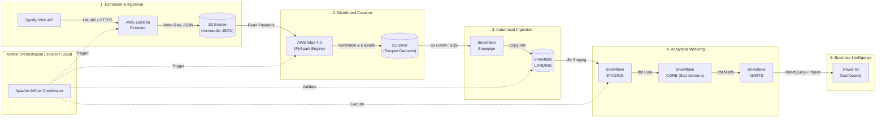
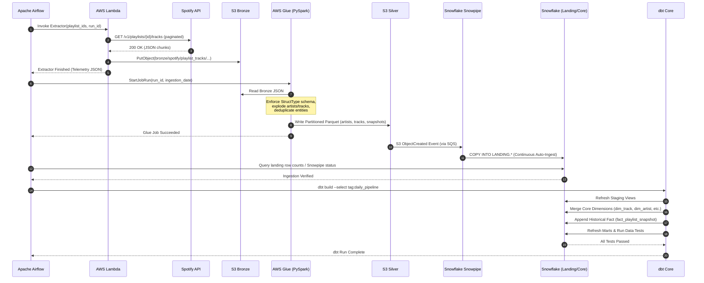

# Platform Architecture Documentation

This document provides a technical deep-dive into the architectural patterns, data flow mechanisms, and component interactions governing the Spotify Analytics Data Platform.

---

## 1. Architectural Philosophy

The platform is designed around four foundational architectural principles:
1. **Decoupled Orchestration**: Orchestration tools (Airflow) coordinate and observe, but never execute compute workloads.
2. **Immutable Lakehouse Tiers**: Raw data in Bronze S3 is immutable, enabling deterministic replayability.
3. **Optimized Engine Work Allocation**: PySpark transforms semi-structured JSON to Parquet; dbt models star schemas natively in Snowflake.
4. **Zero-Trust Cost Governance**: Every component is ephemeral or auto-suspending, guaranteeing strict alignment with portfolio budget limits.

---

## 2. End-to-End Architecture

---

## 3. End-to-End Execution Sequence

---

## 4. Tier Responsibilities & Technology Mapping

### Tier 1: Source & Ingestion
- **Spotify Web API**: Provides RESTful access to playlist and track metadata.
- **AWS Lambda**: Serverless Python function running outside VPC. Pulls credentials from AWS Secrets Manager, fetches paginated tracks, and writes immutable JSON to S3 Bronze.
- **Amazon S3 Bronze**: Durable object storage preserving raw API responses with path format:
  `bronze/spotify/playlist_tracks/ingestion_date=YYYY-MM-DD/run_id=<pipeline_run_id>/playlist_<id>.json`

### Tier 2: Lake Processing (PySpark)
- **AWS Glue 4.0**: Serverless Apache Spark runtime.
- **PySpark Logic**:
  - Enforces explicit `StructType` schemas to quarantine schema drift.
  - Explodes nested arrays: `items[]` -> tracks, `track.artists[]` -> artists.
  - Normalizes entities into clean relational datasets.
  - Writes Snappy-compressed columnar Parquet files into S3 Silver:
    - `silver/artists/`
    - `silver/albums/`
    - `silver/tracks/`
    - `silver/track_artists/`
    - `silver/playlist_snapshots/`

### Tier 3: Warehouse Ingestion (Snowflake)
- **Snowpipe**: Serverless continuous ingestion listening to S3 event notifications via Amazon SQS.
- **Landing Schema**: 1:1 typed relational tables reflecting S3 Silver Parquet files without transformation.

### Tier 4: Warehouse Transformation (dbt Core)
- **dbt Core**: Executes pushdown SQL inside Snowflake.
- **Layering**:
  - `STAGING`: Light cleansing, column renaming, null handling (`stg_spotify_*`).
  - `CORE`: Kimball dimensional star schema (`dim_track`, `dim_artist`, `dim_album`, `dim_playlist`, `bridge_track_artist`, `fact_playlist_snapshot`).
  - `MARTS`: Aggregated reporting tables (`mart_artist_performance`, `mart_playlist_trends`, `mart_playlist_changes`).
  - `TESTS`: Automated schema tests and business rule assertions.

### Tier 5: Serving & Consumption
- **Power BI**: Connects via Snowflake native connector to `MARTS` models to visualize track longevity, churn, and artist performance.
