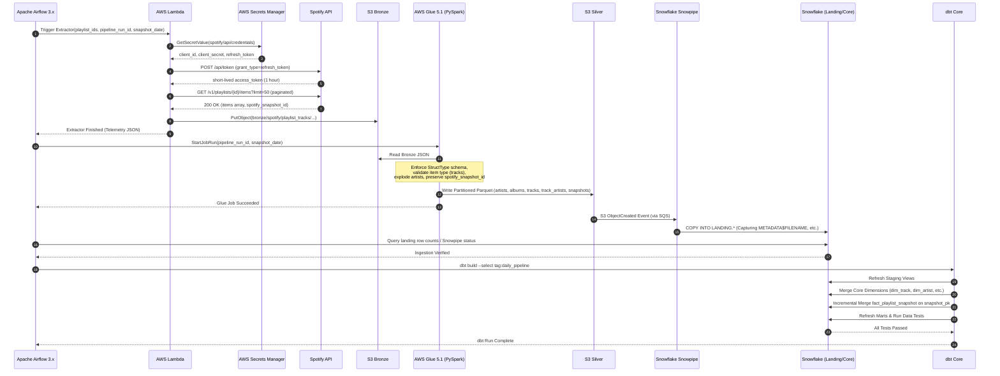

# Platform Architecture Documentation

This document provides a technical deep-dive into the architectural patterns, data flow mechanisms, and component interactions governing the Spotify Analytics Data Platform.

---

## 1. Architectural Philosophy

The platform is designed around four foundational architectural principles:
1. **Decoupled Orchestration**: Orchestration tools (Apache Airflow 3.x) coordinate and observe, but never execute compute workloads.
2. **Immutable Lakehouse Tiers**: Raw data in Bronze S3 is immutable, enabling deterministic replayability.
3. **Specialized Compute Allocation**: AWS Glue 5.1 (PySpark 3.5.6) handles semi-structured array explosion and Parquet serialization; dbt Core models star schemas natively in Snowflake.
4. **Target-Governed Ephemeral Operations**: Every cloud component is ephemeral or auto-suspending, guaranteeing alignment with portfolio budget targets.

---

## 2. End-to-End Architecture

```mermaid
flowchart LR
    subgraph Auth["OAuth 2.0 Auth Side-Flow"]
        DevUser["Developer / User<br/>(One-Time Interactive)"] -->|Authorize Scopes| SpotifyAuth["Spotify Accounts Service<br/>(Auth Code Flow)"]
        SpotifyAuth -->|Refresh Token| SM[("AWS Secrets Manager<br/>(spotify/api/credentials)")]
    end

    subgraph S1["1. Extraction & Ingestion"]
        SM -.->|Fetch Refresh Token| Lambda["AWS Lambda<br/>Extractor"]
        Lambda -->|Token Exchange & GET /items| API["Spotify Web API<br/>(/v1/playlists/{id}/items)"]
        API -->|Raw JSON (50/page)| Lambda
        Lambda -->|Write Raw JSON| Bronze[("S3 Bronze<br/>(Immutable JSON)")]
    end

    subgraph S2["2. Distributed Curation"]
        Bronze -->|Read Payloads| Glue["AWS Glue 5.1<br/>(Spark 3.5.6 / Python 3.11)"]
        Glue -->|Normalize & Explode| Silver[("S3 Silver<br/>(Parquet Datasets)")]
    end

    subgraph S3["3. Automated Ingestion"]
        Silver -->|S3 Event / SQS| Snowpipe["Snowflake<br/>Snowpipe"]
        Snowpipe -->|Copy Into| Landing[("Snowflake<br/>LANDING")]
    end

    subgraph S4["4. Analytical Modeling"]
        Landing -->|dbt Staging| Staging["Snowflake<br/>STAGING"]
        Staging -->|dbt Core| Core["Snowflake<br/>CORE (Star Schema)"]
        Core -->|dbt Marts| Marts["Snowflake<br/>MARTS"]
    end

    subgraph S5["5. Business Intelligence"]
        Marts -->|DirectQuery / Import| PowerBI["Power BI<br/>Dashboards"]
    end

    subgraph Orchestration["Airflow 3.x Orchestration (Docker / Local)"]
        Airflow["Apache Airflow 3.x<br/>(Task SDK & Deadline Alerts)"]
        Airflow -.->|1. Trigger| Lambda
        Airflow -.->|2. Trigger| Glue
        Airflow -.->|3. Validate| Landing
        Airflow -.->|4. Execute| dbt
    end
```

---

## 3. End-to-End Execution Sequence



---

## 4. Tier Responsibilities & Technology Mapping

### Authentication Flow (Decoupled Operator Setup)
- Initial interactive authorization is performed out-of-band by the operator using Spotify's Authorization Code Flow.
- The granted `refresh_token` is saved to AWS Secrets Manager.
- Airflow and Lambda execute non-interactively, dynamically exchanging the refresh token for a 1-hour access token at runtime.

### Tier 1: Source & Ingestion
- **Spotify Web API**: Ingests `/v1/playlists/{playlist_id}/items` using limit=50 pagination.
- **AWS Lambda**: Serverless Python 3.12 runtime. Pulls refresh token from Secrets Manager, exchanges for access token, fetches paginated items, captures `spotify_snapshot_id`, and writes immutable JSON to S3 Bronze.
- **Amazon S3 Bronze**: Durable object storage preserving raw API responses with path format:
  `bronze/spotify/playlist_tracks/ingestion_date=YYYY-MM-DD/run_id=<pipeline_run_id>/playlist_<id>.json`

### Tier 2: Lake Processing (PySpark)
- **AWS Glue 5.1**: Managed Apache Spark 3.5.6 and Python 3.11 runtime.
- **PySpark Logic**:
  - Enforces explicit `StructType` schemas to quarantine schema drift.
  - Validates playlist items and extracts track objects (quarantining non-track items).
  - Normalizes entities into clean relational datasets.
  - Writes Snappy-compressed columnar Parquet files into S3 Silver:
    - `silver/artists/`
    - `silver/albums/`
    - `silver/tracks/`
    - `silver/track_artists/`
    - `silver/playlist_snapshots/`

### Tier 3: Warehouse Ingestion (Snowflake)
- **Snowpipe**: Serverless continuous ingestion listening to S3 event notifications via Amazon SQS.
- **Landing Schema**: 1:1 typed relational tables reflecting S3 Silver Parquet files with ingestion audit metadata (`METADATA$FILENAME`, `METADATA$FILE_ROW_NUMBER`, `_loaded_at`).

### Tier 4: Warehouse Transformation (dbt Core)
- **dbt Core**: Executes pushdown SQL inside Snowflake.
- **Layering**:
  - `STAGING`: Light cleansing, column renaming, null handling (`stg_spotify_*`).
  - `CORE`: Kimball dimensional star schema (`dim_track`, `dim_artist`, `dim_album`, `dim_playlist`, `bridge_track_artist`, `fact_playlist_snapshot`).
  - `MARTS`: Aggregated reporting tables (`mart_artist_presence`, `mart_playlist_trends`, `mart_track_lifecycle`, `mart_playlist_changes`).
  - `TESTS`: Automated schema tests and business rule assertions.

### Tier 5: Serving & Consumption
- **Power BI**: Connects via Snowflake native connector to `MARTS` models to visualize track longevity, churn, position changes, and artist presence.
