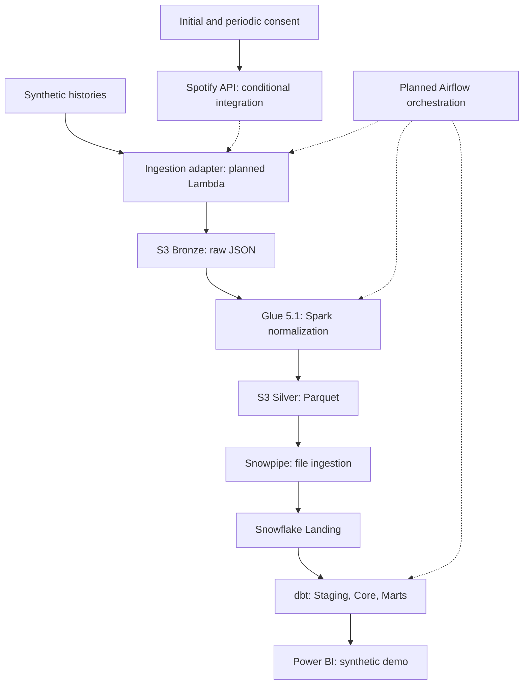
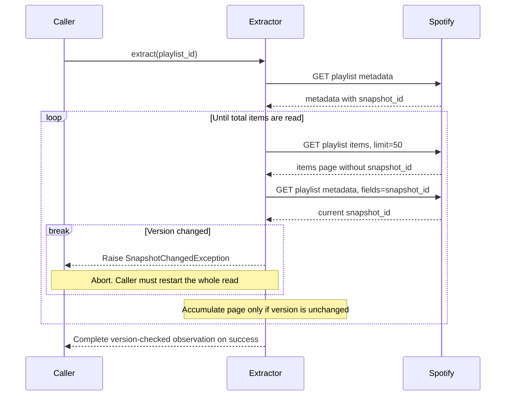
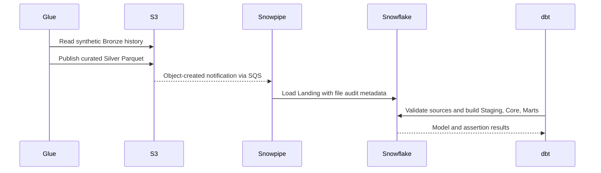

# Platform Architecture Documentation

This document specifies the target architecture. M1 currently implements the local auth client, extractor, and synthetic fixtures/parser only. Cloud services, transformation layers, and orchestration remain planned. The diagram shows a future synthetic demo path plus a conditional API integration; no synthetic runner is implemented yet. Live analytical use remains unresolved under [ADR-0008](adr/0008-synthetic-analytics-and-source-use-boundary.md).

---

## 1. Architectural Philosophy

The platform is designed around four foundational architectural principles:
1. **Decoupled Orchestration**: Orchestration tools (Apache Airflow 3.x) coordinate and observe, but never execute compute workloads.
2. **Immutable Lakehouse Tiers**: Raw data in Bronze S3 is immutable, enabling deterministic replayability.
3. **Specialized Compute Allocation**: AWS Glue 5.1 (PySpark 3.5.6) handles semi-structured array explosion and Parquet serialization; dbt Core models star schemas natively in Snowflake.
4. **Cost-Conscious Operations**: Planned on-demand compute and auto-suspension reduce idle costs. They do not enforce a cross-provider spending cap; estimates need workload and billing validation.

---

## 2. End-to-End Architecture

---

## 3. Implemented Extraction and Planned Downstream Sequence

### Implemented local extraction contract

Tests substitute synthetic responses at the HTTP boundary. The sequence describes
the client behavior; it is not evidence of live API validation or permission for
live analytical use. Token exchange/caching is handled by `SpotifyAuthClient`.

An observed mismatch terminates the method immediately. Successful checks are
optimistic validation, not a server-side transaction or pinned historical read.
The method returns metadata, raw pages, and consolidated items without writing
files. The parser is opt-in and does not filter the extractor result.

### Planned downstream execution

After M1 persistence and cloud adapters are implemented, Airflow will coordinate
the stages below. Synthetic histories supply the portfolio demonstration; the
Spark and dbt responsibilities remain unchanged.

Airflow must verify curated publication and Landing readiness before invoking
dbt. These orchestration and quality gates are planned, not validated behavior.

---

## 4. Tier Responsibilities & Technology Mapping

### Authentication Flow (Conditional Integration)
- Initial consent and periodic reauthorization are operator steps under ADR-0007; no consent utility is implemented.
- Secure refresh-token storage is planned for Secrets Manager. Current rotation is in-memory only.
- Future scheduled exchanges run non-interactively while the grant is valid. Refresh tokens expire six months from authorization; access-token renewal does not extend that grant.

### Tier 1: Source & Ingestion
- **Spotify Web API**: Ingests `/v1/playlists/{playlist_id}/items` using limit=50 pagination.
- **AWS Lambda**: Serverless Python 3.12 runtime. Pulls refresh token from Secrets Manager, exchanges for access token, fetches paginated items, captures `spotify_snapshot_id`, and writes immutable JSON to S3 Bronze.
- **Amazon S3 Bronze**: Durable object storage preserving raw API responses with path format:
  `bronze/spotify/playlist_tracks/ingestion_date=YYYY-MM-DD/run_id=<pipeline_run_id>/playlist_<id>.json`

### Tier 2: Lake Processing (PySpark)
- **AWS Glue 5.1**: Planned Apache Spark 3.5.6 / Python 3.11 runtime, separate from the Python >=3.12 ingestion package. Shared code needs explicit compatibility checks.
- **PySpark Logic**:
  - Enforces explicit `StructType` schemas to quarantine schema drift.
  - Validates playlist items and extracts track objects (quarantining non-track items).
  - Normalizes entities into clean relational datasets.
  - Writes Snappy-compressed columnar Parquet files into S3 Silver:
    - `silver/artists/`
    - `silver/albums/`
    - `silver/tracks/`
    - `silver/track_artists/`
    - `silver/playlist_snapshots/`

### Tier 3: Warehouse Ingestion (Snowflake)
- **Snowpipe**: Serverless continuous ingestion listening to S3 event notifications via Amazon SQS.
- **Landing Schema**: 1:1 typed relational tables reflecting S3 Silver Parquet files with ingestion audit metadata (`METADATA$FILENAME`, `METADATA$FILE_ROW_NUMBER`, `_loaded_at`).

### Tier 4: Warehouse Transformation (dbt Core)
- **dbt Core**: Executes pushdown SQL inside Snowflake.
- **Layering**:
  - `STAGING`: Light cleansing, column renaming, null handling (`stg_spotify_*`).
  - `CORE`: Kimball dimensional star schema (`dim_track`, `dim_artist`, `dim_album`, `dim_playlist`, `bridge_track_artist`, `fact_playlist_snapshot`).
  - `MARTS`: Aggregated reporting tables (`mart_artist_presence`, `mart_playlist_trends`, `mart_track_lifecycle`, `mart_playlist_changes`).
  - `TESTS`: Automated schema tests and business rule assertions.

### Tier 5: Serving & Consumption
- **Power BI**: Connects via Snowflake native connector to `MARTS` models to visualize track longevity, churn, position changes, and artist presence.
