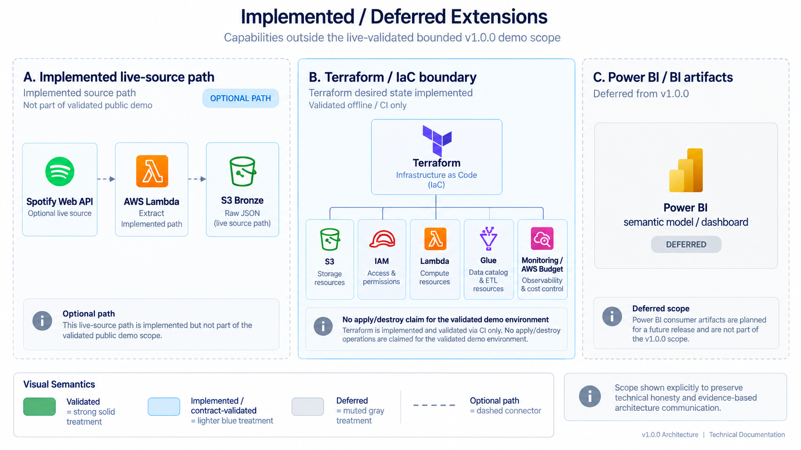

# Platform Architecture

This document is the technical architecture reference for the **Spotify Analytics Data Platform**. It explains the runtime topology, data boundaries, execution model, reliability mechanisms, and architectural trade-offs behind the v1.0.0 portfolio release.

The public portfolio claim is intentionally narrower than the full target architecture: the **live-validated bounded path starts from CC0-backed Bronze input**, while the Spotify Web API → Lambda source path is implemented and contract-tested separately. This distinction is part of the architecture, not a footnote.

---

## 1. Architecture in One View


*System context: the bounded demo follows the solid CC0 → Bronze → Glue/Silver → Snowpipe/Snowflake → dbt → serving route. The dashed Spotify API/Lambda source path is implemented separately; Power BI remains optional and deferred.*

<!--
VISUAL ASSET 08
Target: docs/assets/architecture/system-architecture-detailed.png
Prompt: docs/assets/README.md#08--detailed-system-architecture
Future deeper view; replace this comment only after generating and reviewing the distinct detailed architecture image:

-->

```text
VALIDATED BOUNDED DATA PATH

CC0-backed local snapshots
          │
          ▼
     Airflow upload
          │
          ▼
   Amazon S3 Bronze
          │
          ▼
 AWS Glue 5.1 / Spark 3.5.6
          │
          ▼
 Amazon S3 Silver / Parquet
          │
          ▼
 Snowpipe → Snowflake LANDING
          │
          ▼
 dbt STAGING → CORE → MARTS
          │
          ▼
 Snowflake BI_* serving views

  coordinated by Airflow 3.2.2
  with exact readiness gates,
  run evidence and safe replay


OPTIONAL LIVE-SOURCE PATH

Spotify Web API → AWS Lambda / Python 3.12 → S3 Bronze
```

The two source paths converge at the Bronze contract. The bounded public demo does **not** claim that Lambda fetched the CC0 demo data from Spotify.

---

## 2. Architectural Principles

### 2.1 Orchestration is coordination, not compute

Apache Airflow owns dependency ordering, bounded retries, external service coordination, readiness checks, deadlines, failure evidence, and run-level reporting. It does not perform Spark transformations or warehouse modeling in worker memory.

### 2.2 Physical processing attempts are immutable

Every physical snapshot attempt receives a fresh UUID v4 `pipeline_run_id`. Bronze and Silver objects are written to run-scoped paths, and replay creates new physical evidence rather than mutating prior attempts.

### 2.3 Logical analytics converge independently from physical lineage

The canonical fact grain is:

```text
(playlist_id, snapshot_date, track_position)
```

`pipeline_run_id` remains lineage. It is intentionally excluded from the analytical primary grain so that replay does not create duplicate business facts.

### 2.4 Technical curation and business modeling are separate concerns

Glue/Spark owns source-shape normalization, schema enforcement, item validation, array explosion, technical deduplication and Parquet serialization. dbt/Snowflake owns dimensional semantics, incremental merge behavior, marts, serving views and business-quality tests.

### 2.5 A successful service call is not a downstream readiness signal

Glue success is followed by a run-scoped completion manifest. Airflow then verifies exact Landing filenames and row counts before dbt can start. The platform fails closed when the next tier cannot prove completeness.

### 2.6 Portfolio claims follow evidence, not design intent

The repository explicitly differentiates implemented contracts, live-validated behavior, offline IaC validation, optional paths and deferred consumers. This prevents diagrams or documentation from overstating the environment actually exercised.

---

## 3. Component Responsibilities

<!--
VISUAL ASSET 09
Target: docs/assets/architecture/component-responsibilities.png
Prompt: docs/assets/README.md#09--component-responsibilities
When ready:

-->

| Component | Architectural responsibility | Explicit non-responsibility | v1.0.0 evidence |
|---|---|---|---|
| **CC0 demo adapter** | Produce reproducible source-shaped Bronze inputs with synthetic temporal evolution. | Does not represent observed Spotify history. | Used by the bounded live cloud demo. |
| **Spotify Web API client** | Fetch user-authorized playlist items and source snapshot identity. | Does not define analytical history by itself. | Source/auth contracts tested; not part of bounded live demo. |
| **AWS Lambda** | Run the optional Python 3.12 live extractor and publish immutable Bronze objects. | Does not transform Silver or model analytics. | Implemented/contract-tested source path. |
| **Amazon S3 Bronze** | Preserve immutable source-shaped payloads and physical execution lineage. | Does not expose analytical tables. | Live validated in bounded path. |
| **AWS Glue 5.1 / Spark** | Enforce technical schemas, normalize source structures and create six Silver Parquet datasets. | Does not own dimensional/business semantics. | Live validated. |
| **Amazon S3 Silver** | Persist curated, typed Parquet plus completion metadata. | Does not determine warehouse readiness by object existence alone. | Live validated. |
| **Snowpipe** | Continuously ingest Silver files into typed Snowflake Landing tables. | Does not assert model-level correctness. | Live validated. |
| **Snowflake LANDING** | Preserve curated rows with file/row audit metadata. | Does not contain final business semantics. | Live validated. |
| **dbt Core** | Build staging, dimensions, bridge, canonical fact, marts, serving views and data tests. | Does not parse raw API arrays or own source extraction. | Live validated, 152/152 nodes/tests in validated builds. |
| **Apache Airflow 3.2.2** | Coordinate external work, readiness gates, deadlines, retries, replay boundaries and evidence. | Does not act as the data-processing engine. | Live validated for bounded CC0 path. |
| **Terraform** | Declare AWS S3/IAM/Lambda/Glue/monitoring/budget shape. | Does not prove live state ownership unless imported/applied. | Offline validated; no apply/destroy claim. |
| **GitHub Actions** | Continuously validate code, Spark, Snowflake SQL, dbt, Airflow and Terraform contracts. | Does not provision production infrastructure. | Green on v1.0.0 `main`. |
| **Snowflake BI views** | Expose stable analytical consumption contracts. | Do not embed dashboard-specific presentation logic. | Live queried with `SPOTIFY_ANALYST`. |

---

## 4. Validated End-to-End Execution

The bounded live demo follows the current Airflow DAG rather than the older target-path sequence that began with Lambda.

### Step 1 — Plan immutable physical work

Airflow receives a bounded `start_date` / `end_date`, validates that each requested date exists in the generated CC0 manifest, and creates one physical UUID v4 `pipeline_run_id` for each snapshot record.

The plan persists:

- logical snapshot date;
- source provenance (`source_type=cc0_demo`, `temporal_state=synthetic`);
- physical run ID;
- source snapshot identifier;
- local source file and content hash;
- target Bronze key.

### Step 2 — Publish Bronze immutably

Airflow uploads the source-shaped JSON to the run-scoped S3 Bronze key. Retrying an upload is allowed only when the already-published object is byte-identical to the planned payload.

This gives Bronze two properties:

1. a physical attempt can be inspected later; and
2. a transient retry cannot silently replace the source bytes for that attempt.

### Step 3 — Submit Glue exactly once per physical attempt

Airflow writes a submission claim and calls the existing Glue job. The submit task deliberately has `retries=0`, and SDK retries are disabled for `StartJobRun`.

This differs from safe read/check operations. If a network timeout occurs after AWS accepted a submission, blindly retrying the call could create duplicate physical work. Recovery therefore inspects the external state and uses a new DAG run when a new physical attempt is required.

### Step 4 — Curate Bronze into six Silver datasets

Glue 5.1 runs Spark 3.5.6 / Python 3.11 and writes:

```text
artists
albums
tracks
track_artists
playlist_snapshots
playlist_observations
```

The job also writes `metadata/curation/<pipeline_run_id>/complete.json`, which inventories the exact Silver files, row counts, lineage fields and rejected-item count. If curation or inventory construction fails, no valid completion marker is published.

### Step 5 — Let Snowpipe ingest Silver

S3 object-created events notify the Snowflake-managed queue used by Snowpipe. Each Landing table retains source file metadata, including filename and file-row number, so ingestion can be reconciled against the Glue manifest.

### Step 6 — Prove Landing readiness

Airflow does not interpret “Snowpipe exists” or “some rows appeared” as readiness. For each required dataset it verifies the exact run-scoped filenames, expected row counts and distinct file-row numbers.

Unexpected files, duplicate rows, excess rows, missing positive-row files, or rejected demo items prevent the pipeline from advancing to dbt.

### Step 7 — Build the analytical warehouse with dbt

After all Landing gates pass, dbt builds:

```text
LANDING → STAGING → CORE → MARTS → BI_* serving views
```

The validated builds completed **152/152 nodes/tests** successfully. dbt owns logical convergence on the canonical grain, so replaying a physical attempt does not inflate the fact table.

### Step 8 — Persist run evidence

The final reporting path records overall status and can consolidate the run artifacts into `pipeline-run-report.json`. The report captures execution identity, source provenance, row-count evidence, Glue metadata, dbt results and component durations.

See [`OBSERVABILITY.md`](OBSERVABILITY.md) for the evidence schema.

---

## 5. Optional Live Spotify Source Path

The repository also implements the source-side architecture required for live Spotify extraction:

```text
operator authorization
      │
      ▼
OAuth Authorization Code + refresh token
      │
      ▼
AWS Secrets Manager
      │
      ▼
AWS Lambda / Python 3.12
      │
      ├── fetch playlist snapshot identity
      ├── paginate /v1/playlists/{id}/items
      ├── verify source version consistency
      └── publish immutable Bronze JSON
```

The live-source contract is intentionally independent of the public CC0 demo. That makes the portfolio reproducible without requiring a reviewer to possess the project owner's Spotify account state, quota or authorization.

The source path must therefore be described as **implemented and contract-tested**, not as part of the final bounded live run unless separate extractor evidence is captured.

---

## 6. Identity and Lineage Model

The platform uses several identifiers because they answer different questions:

| Identifier | Meaning |
|---|---|
| `airflow_run_id` | One orchestration run covering a bounded logical date window. |
| `run_key` | Filesystem/S3-safe deterministic key derived from the Airflow run ID. |
| `pipeline_run_id` | One physical processing attempt with its own immutable Bronze/Silver evidence. |
| `spotify_snapshot_id` | Upstream playlist source version, or explicitly simulated source version in the CC0 demo. |
| `snapshot_date` | Logical analytical observation date. |

These identities are intentionally not collapsed into a single “run ID”. Source version, orchestration execution and analytical grain are different dimensions of lineage.

---

## 7. Storage Architecture

The low-cost AWS shape uses one lake bucket with explicit prefixes rather than multiplying buckets without a security or lifecycle reason:

```text
s3://<lake>/
├── bronze/       # immutable source-shaped payloads
├── silver/       # curated Parquet datasets
├── artifacts/    # deployable/runtime artifacts
└── metadata/     # curation and pipeline-run evidence
```

The Terraform definition adds versioning, SSE-S3 (`AES256`), public-access blocking, TLS-only bucket policy, incomplete multipart cleanup and non-current version expiration.

The live bounded environment existed before Terraform ownership was introduced, so the repository does not claim that all current objects/resources are already managed by Terraform state.

---

## 8. Warehouse Architecture

Snowflake is organized by responsibility:

| Schema | Role |
|---|---|
| `LANDING` | One-to-one relational ingestion of the six Silver datasets plus file metadata. |
| `STAGING` | dbt normalization, naming and source-level semantic cleanup. |
| `CORE` | Dimensions, bridge and canonical playlist snapshot fact. |
| `MARTS` | Analytical change, lifecycle, trend and artist-presence models plus `BI_*` serving views. |

The warehouse intentionally keeps physical ingestion evidence available until dbt has established the analytical semantics. See [`DATA_MODEL.md`](DATA_MODEL.md).

---

## 9. Reliability and Replay Model

### Safe retries

Read/check/idempotent work may use retries with exponential backoff. Operations with ambiguous external side effects receive stricter treatment.

The most important example is Glue submission:

```text
safe check/read     → retryable
immutable upload   → retry only if bytes are identical
Glue StartJobRun   → no blind retry
sensor/readiness   → reschedule / continue checking
```

### Replay

`scripts/replay_partition.py` is dry-run by default. Execution creates a new DAG run and new physical run IDs. It does not purge prior Bronze/Silver attempts.

### Deadlines and failure evidence

Airflow 3 uses a `DeadlineAlert` referenced to `DAGRUN_QUEUED_AT` with a two-hour interval. Structured callbacks emit `DAG_FAILED` and `DAG_DEADLINE_MISSED` context without serializing credential-bearing exception bodies.

---

## 10. Cross-Tier Quality Architecture

Quality checks are placed where the relevant evidence first becomes available:

```text
Bronze contract
   ↓
Spark/Silver technical validation
   ↓
Glue completion inventory
   ↓
exact Snowflake Landing readiness
   ↓
dbt relationship/grain/business tests
   ↓
serving-view coverage tests
```

This prevents a late-stage dbt test suite from being the only protection against incomplete physical ingestion.

The repository aggregates these contracts under:

```bash
make check-quality
```

---

## 11. Infrastructure and CI Architecture

Terraform declares the intended AWS development shape for:

- S3;
- IAM;
- Lambda;
- Glue;
- CloudWatch log groups;
- AWS Budget notifications.

CI validates that code without cloud credentials using:

```text
terraform fmt -check
terraform init -backend=false
terraform validate
tflint
checkov
```

The same GitHub Actions workflow independently checks Python/Ruff, Glue-parity Spark contracts, Snowflake SQL, dbt manifests and Airflow DAG/service contracts.

No CI job applies infrastructure.

---

## 12. Security Boundaries

The architecture separates credentials from code and keeps permissions scoped to service responsibilities:

- Spotify credentials are represented by a Secrets Manager ARN in Terraform, never by secret values in state variables committed to source control.
- Local Airflow secrets belong in ignored `.env` / `airflow/secrets/` paths.
- The validated Airflow AWS identity was scoped to the S3 and Glue operations required by orchestration rather than using broad account-admin permissions.
- Snowflake distinguishes transform and analyst responsibilities through `SPOTIFY_TRANSFORMER` and `SPOTIFY_ANALYST` roles.
- CI Terraform validation requires no AWS credentials.

See [`SECURITY.md`](SECURITY.md) for the full security model.

---

## 13. Cost Architecture

The portfolio target is **USD 20/month**, treated as an operating target rather than a hard provider-side stop.

Structural controls include:

- local Docker Airflow instead of MWAA;
- no always-on EC2/EMR/Kubernetes compute;
- no NAT Gateway requirement in the Terraform Lambda shape;
- bounded Glue workers, concurrency and timeout;
- Snowflake X-Small warehouse with 60-second auto-suspend and resource monitor;
- seven-day CloudWatch retention in Terraform;
- AWS Budget notification contract in Terraform.

The live demo account also used a separate manually created USD 5 AWS Budget guardrail. This is distinct from the reusable Terraform USD 20 portfolio contract.

See [`COST_STRATEGY.md`](COST_STRATEGY.md) for measured usage and cost caveats.

---

## 14. Serving Boundary

v1.0.0 stops at tested Snowflake serving views:

```text
BI_PLAYLIST_DAILY
BI_TRACK_DAILY
BI_TRACK_CHANGES
BI_ARTIST_DAILY
```

They define a BI-facing semantic handoff while remaining independent of a specific dashboard tool. Power BI semantic modeling, DAX and dashboard assets were intentionally deferred from this release.

See [`SERVING_CONTRACT.md`](SERVING_CONTRACT.md).

---

## 15. Scope Boundaries and Deferred Components



*Release-scope boundaries. The Spotify API/Lambda source is implemented but was not part of the bounded cloud demo; Terraform defines and validates the desired AWS infrastructure without claiming ownership of the pre-existing live resources; Power BI artifacts are deferred from v1.0.0.*

The optional source architecture, the **Terraform desired-state contract**, and a possible downstream BI tool belong to different evidence categories. None should be represented as an extra step performed in the validated CC0 run. The supported release endpoint is the tested Snowflake `BI_*` serving contract; see [the serving specification](SERVING_CONTRACT.md) and [Terraform ownership guidance](../infra/terraform/README.md).

---

## 16. Validation Matrix

| Area | Evidence level |
|---|---|
| Python platform code | Offline automated tests + CI |
| Spotify auth/source contracts | Automated tests; not part of bounded final live path |
| Glue 5.1 / Spark 3.5.6 | Local parity contracts + bounded live Glue execution |
| S3 Bronze/Silver | Bounded live execution |
| Snowpipe / Snowflake Landing | Bounded live execution + exact readiness checks |
| dbt Core | Parse/contracts + bounded live builds, 152/152 passing |
| Airflow DAG | CI contracts + bounded live orchestration |
| Replay/idempotency | Bounded live one-day replay |
| Snowflake serving views | Live queried with analyst role |
| Terraform | fmt/init/validate/TFLint/Checkov; no live ownership claim |
| Power BI | Deferred; no v1.0.0 implementation claim |

---

## 17. Intentional Trade-offs and Non-Goals

The v1.0.0 portfolio architecture intentionally does **not** optimize for 24/7 enterprise operation.

It does not claim:

- MWAA or another managed Airflow deployment;
- production paging/on-call integration;
- a live Spotify extraction in the bounded public demo;
- Terraform ownership of every pre-existing live resource;
- Power BI/DAX/dashboard implementation;
- synthetic temporal behavior as real Spotify history.

Those omissions keep the project focused on demonstrable data-engineering concerns: immutable ingestion, distributed curation, warehouse modeling, orchestration, quality, observability, replay, IaC and cost-aware operation.

---

## 18. Architecture Decision Records

The rationale behind the major choices is versioned in [`adr/`](adr/):

- [ADR-0001 — Airflow as orchestrator](adr/0001-airflow-as-orchestrator.md)
- [ADR-0002 — S3 as durable landing zone](adr/0002-s3-as-durable-landing-zone.md)
- [ADR-0003 — Parquet for curated data](adr/0003-parquet-for-curated-data.md)
- [ADR-0004 — Snowflake as analytical warehouse](adr/0004-snowflake-as-analytical-warehouse.md)
- [ADR-0005 — Separate Spark and dbt responsibilities](adr/0005-separate-spark-and-dbt-responsibilities.md)
- [ADR-0006 — Historical playlist snapshots](adr/0006-historical-playlist-snapshots.md)
- [ADR-0007 — Spotify Authorization Code + refresh token](adr/0007-spotify-authorization-code-and-refresh-token.md)
- [ADR-0009 — CC0 source with synthetic temporal demo](adr/0009-cc0-source-with-synthetic-temporal-demo.md)

For an interview-oriented explanation of these decisions, see [`INTERVIEW_GUIDE.md`](INTERVIEW_GUIDE.md).
