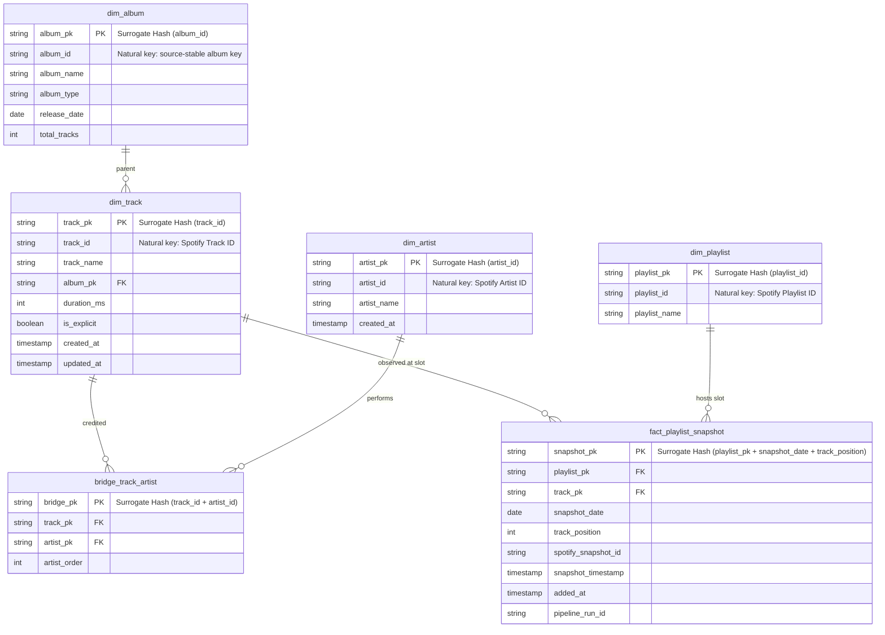

# Data Model & Analytical Contracts

This document defines the **warehouse modeling contract** for the Spotify Analytics Data Platform: how curated Silver data is represented in Snowflake, how logical business grain is separated from physical execution lineage, how dbt builds the dimensional model, and how analytical semantics reach the `BI_*` serving views.

The model is designed for replayability. A new physical `pipeline_run_id` may reprocess a logical date without creating a second business fact because execution identity and analytical identity are deliberately different concepts.

---

## 1. Architectural Modeling Tiers

The warehouse contract evolves through four Snowflake schemas and a serving surface:

<!--
VISUAL ASSET 17
Target: docs/assets/data-model/modeling-layers.png
Prompt: docs/assets/README.md#17--warehouse-modeling-layers
When ready:

-->

```
S3 Silver Parquet
       │
       ▼
1. LANDING Schema       (Raw 1:1 Parquet ingestion tables loaded via Snowpipe)
       │
       ▼
2. STAGING Schema       (dbt views with normalized naming, casting, item validation, and deduplication)
       │
       ▼
3. CORE Schema          (dbt Kimball dimensional star schema: dimensions, facts, bridge)
       │
       ▼
4. MARTS Schema         (dbt analytical marts and stable BI-serving views)
       │
       ▼
5. BI_* Views           (tool-agnostic analytical consumption contract)
```

| Layer | Grain responsibility | Main quality responsibility |
|---|---|---|
| `LANDING` | Preserve the row grain emitted by the six Silver datasets. | File/row lineage and exact physical ingestion evidence. |
| `STAGING` | Normalize source entities and choose authoritative logical observations. | Type cleanup, deduplication and source-level validity. |
| `CORE` | Establish durable dimensions and canonical playlist snapshot fact grain. | Uniqueness, referential integrity and stable surrogate keys. |
| `MARTS` | Derive analytical grains for trends, lifecycle, churn and artist presence. | Business rules and grain-specific tests. |
| `BI_*` | Present consumer-safe names, units, positions and provenance. | Serving row keys, coverage and semantic handoff. |

The public v1.0.0 release is **BI-tool agnostic**. Power BI remains an optional downstream consumer; the implemented contract stops at tested Snowflake serving views.

---

## 2. Layer 1: LANDING Schema (Snowflake)

Tables in `LANDING` map directly to the S3 Silver Parquet outputs generated by AWS Glue 5.1. Note that per Spotify Web API 2026 specifications, deprecated `popularity` fields have been decommissioned from source responses.

### `landing_artists`
| Column | Type | Nullable | Description |
| :--- | :--- | :--- | :--- |
| `artist_id` | VARCHAR(64) | NO | Spotify artist URI identifier |
| `artist_name` | VARCHAR(255) | NO | Display name of the artist |
| `ingestion_date` | DATE | NO | S3 partition date (YYYY-MM-DD) |
| `_loaded_at` | TIMESTAMP_NTZ | NO | Snowpipe load timestamp |
| `_file_name` | VARCHAR(512) | NO | Snowflake `METADATA$FILENAME` |
| `_file_row_number` | INTEGER | NO | Snowflake `METADATA$FILE_ROW_NUMBER` |

### `landing_albums`
| Column | Type | Nullable | Description |
| :--- | :--- | :--- | :--- |
| `album_id` | VARCHAR(64) | NO | Source-stable album key; provider ID when available, adapter-generated otherwise |
| `album_name` | VARCHAR(255) | NO | Album title |
| `album_type` | VARCHAR(32) | YES | e.g., 'album', 'single', 'compilation' |
| `release_date` | VARCHAR(16) | YES | Source release date string (YYYY or YYYY-MM-DD) |
| `total_tracks` | INTEGER | YES | Declared track count on the album |
| `ingestion_date` | DATE | NO | S3 partition date |
| `_loaded_at` | TIMESTAMP_NTZ | NO | Snowpipe load timestamp |
| `_file_name` | VARCHAR(512) | NO | Snowflake `METADATA$FILENAME` |
| `_file_row_number` | INTEGER | NO | Snowflake `METADATA$FILE_ROW_NUMBER` |

### `landing_tracks`
| Column | Type | Nullable | Description |
| :--- | :--- | :--- | :--- |
| `track_id` | VARCHAR(64) | NO | Spotify track URI identifier |
| `track_name` | VARCHAR(255) | NO | Song title |
| `album_id` | VARCHAR(64) | YES | Foreign reference to album |
| `duration_ms` | INTEGER | NO | Track duration in milliseconds |
| `is_explicit` | BOOLEAN | YES | True/false when supplied by the source; NULL when unavailable |
| `is_local` | BOOLEAN | NO | True if track is a local file upload |
| `ingestion_date` | DATE | NO | S3 partition date |
| `_loaded_at` | TIMESTAMP_NTZ | NO | Snowpipe load timestamp |
| `_file_name` | VARCHAR(512) | NO | Snowflake `METADATA$FILENAME` |
| `_file_row_number` | INTEGER | NO | Snowflake `METADATA$FILE_ROW_NUMBER` |

### `landing_track_artists`
| Column | Type | Nullable | Description |
| :--- | :--- | :--- | :--- |
| `track_id` | VARCHAR(64) | NO | Spotify track URI identifier |
| `artist_id` | VARCHAR(64) | NO | Spotify artist URI identifier |
| `artist_order` | INTEGER | NO | Positional billing index (0 = primary artist) |
| `ingestion_date` | DATE | NO | S3 partition date |
| `_loaded_at` | TIMESTAMP_NTZ | NO | Snowpipe load timestamp |
| `_file_name` | VARCHAR(512) | NO | Snowflake `METADATA$FILENAME` |
| `_file_row_number` | INTEGER | NO | Snowflake `METADATA$FILE_ROW_NUMBER` |

### `landing_playlist_snapshots`
| Column | Type | Nullable | Description |
| :--- | :--- | :--- | :--- |
| `playlist_id` | VARCHAR(64) | NO | Monitored Spotify playlist identifier |
| `spotify_snapshot_id`| VARCHAR(128) | NO | Source version identifier; deterministic demo version when live provider history is unavailable |
| `playlist_name` | VARCHAR(255) | NO | Playlist title at snapshot time |
| `track_id` | VARCHAR(64) | NO | Track identifier present in playlist slot |
| `track_position` | INTEGER | NO | Zero-indexed track position in playlist |
| `added_at` | TIMESTAMP_NTZ | YES | Timestamp track was added to playlist |
| `snapshot_date` | DATE | NO | Canonical business observation date |
| `snapshot_timestamp`| TIMESTAMP_NTZ | NO | Pipeline snapshot timestamp |
| `pipeline_run_id` | VARCHAR(64) | NO | Non-deterministic physical execution UUID v4 |
| `ingestion_date` | DATE | NO | S3 partition date |
| `_loaded_at` | TIMESTAMP_NTZ | NO | Snowpipe load timestamp |
| `_file_name` | VARCHAR(512) | NO | Snowflake `METADATA$FILENAME` |
| `_file_row_number` | INTEGER | NO | Snowflake `METADATA$FILE_ROW_NUMBER` |

### `landing_playlist_observations`
| Column | Type | Nullable | Description |
| :--- | :--- | :--- | :--- |
| `playlist_id` | VARCHAR(64) | NO | Monitored playlist identifier |
| `spotify_snapshot_id` | VARCHAR(128) | NO | Upstream playlist version identifier |
| `playlist_name` | VARCHAR(255) | NO | Playlist title at observation time |
| `snapshot_date` | DATE | NO | Canonical business observation date |
| `snapshot_timestamp` | TIMESTAMP_NTZ | NO | Physical observation timestamp |
| `pipeline_run_id` | VARCHAR(64) | NO | Physical execution UUID v4 |
| `source_item_count` | INTEGER | NO | Consolidated source item count before filtering |
| `valid_track_count` | INTEGER | NO | Valid source track items eligible for Silver slots |
| `rejected_item_count` | INTEGER | NO | Items excluded by the technical Silver contract |
| `ingestion_date` | DATE | NO | S3 partition date |
| `_loaded_at` | TIMESTAMP_NTZ | NO | Snowpipe load timestamp |
| `_file_name` | VARCHAR(512) | NO | Snowflake `METADATA$FILENAME` |
| `_file_row_number` | INTEGER | NO | Snowflake `METADATA$FILE_ROW_NUMBER` |

---

## 3. Layer 2: STAGING Schema (dbt Models)

Staging models are implemented as views in dbt:
- `stg_spotify_artists`: Deduplicates, cleans names, trims strings.
- `stg_spotify_albums`: Standardizes partial release dates (e.g., '1995' -> '1995-01-01').
- `stg_spotify_tracks`: Enforces non-null assertions and filters invalid non-positive durations.
- `stg_spotify_track_artists`: Validates billing order indices and deduplicates track-artist pairs.
- `stg_spotify_playlist_snapshots`: Validates item types, isolates valid track items, and exposes canonical snapshot attributes.
- `stg_spotify_playlist_observations`: Chooses one authoritative physical run per playlist/date and preserves empty observed days.

---

## 4. Layer 3: CORE Dimensional Schema (Kimball Star Schema)



`dim_playlist` intentionally contains only attributes present in the reviewed M3/M4
Silver-to-Landing contract. `owner_id` and `is_collaborative` are not inferred, filled with
defaults, or collected solely to satisfy an older diagram. Adding either field requires a
new source-contract review and corresponding Silver/Landing schema change.

### Canonical Fact Grain & Key Architecture
- **Canonical Natural Grain**:
  `playlist_id` + `snapshot_date` + `track_position`
  *(One canonical position slot per playlist per business observation date).*
- **Track Relationship**: `track_id` is the dimensional entity observed occupying that position slot at that snapshot date.
- **Surrogate Key (`snapshot_pk`)**:
  `dbt_utils.generate_surrogate_key(['playlist_id', 'snapshot_date', 'track_position'])`
- **Why Timestamps Are Excluded**: Including `snapshot_timestamp` in the natural key breaks idempotency across retries or backfills. Pinned to `snapshot_date`, re-executing a pipeline run safely merges and updates the canonical slot.
- **Source Lineage**: `spotify_snapshot_id` records the upstream playlist state version; `pipeline_run_id` records the physical execution UUID v4.

---

## 5. Layer 4: MARTS Schema (Analytical Business Marts)

Marts translate the canonical dimensional model into purpose-specific analytical grains. They are still **warehouse models**, not dashboard logic: consumer-facing naming, units and provenance are finalized one step later in the `BI_*` serving views.

### 1. `mart_artist_presence`
- **Granularity**: `artist_id` + `snapshot_date`
- **Metrics**: Total tracks across monitored playlists, distinct playlist count, share of all observed playlists (including empty playlists), primary vs. featured billing counts, top observed chart position.

### 2. `mart_playlist_trends`
- **Granularity**: `playlist_id` + `snapshot_date`
- **Metrics**: Total slot count, distinct track count, average track duration, explicit track percentage, average release recency (years), new tracks entered, tracks exited, and distinct-membership turnover rate. Empty observed days remain present with zero counts.

### 3. `mart_track_lifecycle`
- **Granularity**: `playlist_id` + `track_id` + `snapshot_date`
- **Metrics**: Cumulative observed snapshot days on playlist (not wall-clock elapsed tenure), current position, best position achieved, positional change from a directly preceding observed calendar day (`position_delta`).
- **Repeated Track Slots**: If the same track legitimately occupies multiple playlist
  positions on one date, track-level marts use the best (lowest numeric) position while the
  fact table continues preserving every distinct position slot.

### 4. `mart_playlist_changes` (Daily Churn & Retention Mart)
- **Granularity**: `playlist_id` + `track_id` + `snapshot_date`
- **Calculations**:
  - `movement_status`: `'NEW'` (entered today), `'RETAINED'` (present yesterday & today), `'EXITED'` (present yesterday, absent today).
  - `position_delta`: Change in position from previous day (`rank_yesterday - rank_today`).
  - `consecutive_days_retained`: Running count of uninterrupted daily snapshot appearances.

---

## 6. Serving Views

The v1.0.0 consumption surface is four version-controlled Snowflake views in `MARTS`:

| View | Unique grain | Source model | Consumer-oriented semantics |
|---|---|---|---|
| `BI_PLAYLIST_DAILY` | `playlist_id + snapshot_date` | `mart_playlist_trends` | Daily playlist size, duration, additions, exits, turnover and provenance. |
| `BI_TRACK_DAILY` | `playlist_id + track_id + snapshot_date` | `mart_track_lifecycle` | Current/best one-based position and observed-days lifecycle metrics. |
| `BI_TRACK_CHANGES` | `playlist_id + track_id + snapshot_date` | `mart_playlist_changes` | `NEW` / `RETAINED` / `EXITED`, positions and uninterrupted retention streak. |
| `BI_ARTIST_DAILY` | `artist_id + snapshot_date` | `mart_artist_presence` | Credited slots, playlist reach/share and artist-presence metrics. |

Serving views deliberately keep analytical semantics in dbt/Snowflake rather than a dashboard file. A future BI client should consume these contracts instead of re-implementing core calculations independently.

See [`SERVING_CONTRACT.md`](SERVING_CONTRACT.md) for units, null semantics, relationship guidance and refresh rules.

---

## 7. Physical Lineage vs Logical Grain

The most important modeling distinction in the platform is the separation between **physical attempts** and **logical facts**.

```text
physical processing identity
pipeline_run_id = UUID v4
        │
        │ lineage only
        ▼
logical analytical identity
(playlist_id, snapshot_date, track_position)
```

A replay creates a new `pipeline_run_id`, new immutable Bronze/Silver evidence and new warehouse load metadata. dbt then selects the authoritative logical observation and merges on the stable business grain.

This architecture preserves both:

- **forensic history** — every physical attempt can be traced; and
- **analytical idempotency** — reprocessing a logical date does not create a second fact solely because execution identity changed.

`spotify_snapshot_id` remains a separate source-version identifier. It must not be overloaded as either the pipeline execution ID or the analytical primary key.

---

## 8. Temporal Semantics

The model distinguishes observed dates from elapsed wall-clock time.

- `snapshot_date` is the logical observation date.
- `cumulative_days_on_playlist` counts observed dates on which a track is present; it is not elapsed calendar tenure.
- `consecutive_days_retained` requires uninterrupted consecutive daily observations.
- A missing observation date is **unknown**, not evidence that every track exited.
- `NEW` can mean first observed presence or reappearance after a gap; it does not prove a real-world add timestamp.
- Position-change comparisons are valid only across directly consecutive observed days.

These rules prevent missing pipeline days from being silently converted into business events.

---

## 9. Source Provenance and Synthetic Demo Semantics

The serving layer carries provenance so public demo data cannot be mistaken for observed Spotify history.

For the current CC0 demo:

```text
source_type     = cc0_demo
temporal_state  = synthetic
```

Catalog-style metadata originates from the CC0-backed adapter, while playlist membership and longitudinal changes are deterministically generated by this repository.

Rows outside the recognized demo namespace are classified conservatively as `unclassified`; the model does not automatically assert that they represent live observed Spotify activity.

---

## 10. Null and Unit Semantics

Consumer-safe semantics are intentional rather than presentation-layer defaults:

- unknown `is_explicit` remains `NULL`, not `FALSE`;
- unavailable release dates remain `NULL`;
- empty observed playlists can have `NULL` average duration;
- Core/mart positions are zero-based, while `BI_*` display positions are one-based;
- duration exposed by `BI_PLAYLIST_DAILY` is seconds;
- shares and turnover in serving views are ratios from `0` to `1`;
- descriptive names are labels, never stable join keys.

---

## 11. Aggregation Rules

Several measures are intentionally non-additive:

- summing `track_slots` across dates produces **slot-days**, not distinct tracks;
- artist credits can overlap because one track slot can credit multiple artists;
- `playlist_share` is artist reach across observed playlists and should not be expected to sum to 100% across artists;
- daily percentages and averages should not be summed across dates;
- fact-like serving views should not be joined to each other on `snapshot_date` alone.

Consumers that require a semantic model should derive date/playlist/track/artist lookup tables and use one-to-many, single-direction relationships rather than many-to-many joins between fact-like views.

---

## 12. Quality Contracts

The model is guarded at several levels:

1. **Landing readiness** proves the physical Silver files and rows exist exactly as declared by Glue.
2. **Staging tests** enforce source-level validity and deduplication assumptions.
3. **Core tests** enforce primary grain and dimensional relationships.
4. **Mart tests** enforce analytical business rules and expected cardinality.
5. **Serving tests** enforce row-key uniqueness, required labels, accepted movement states, provenance and row-count coverage against source marts.

The full cross-tier contract suite is exposed through:

```bash
make check-quality
```

---

## 13. Validated Release Evidence

The current serving models are no longer merely planned contracts. The bounded Airflow/Snowflake run and the one-day replay both completed a **152/152** dbt build, and the four `BI_*` views were queried successfully with the `SPOTIFY_ANALYST` role.

For this reason, the model can be described as **implemented and live-validated for the bounded portfolio slice**, while still keeping the CC0/synthetic provenance boundary explicit.
