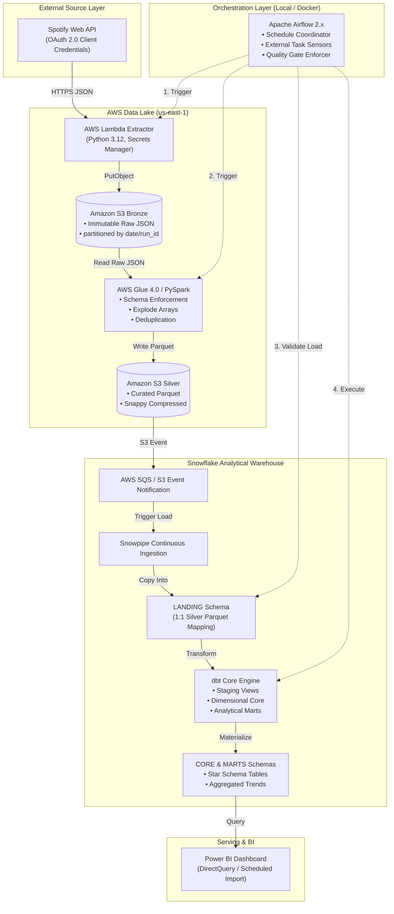
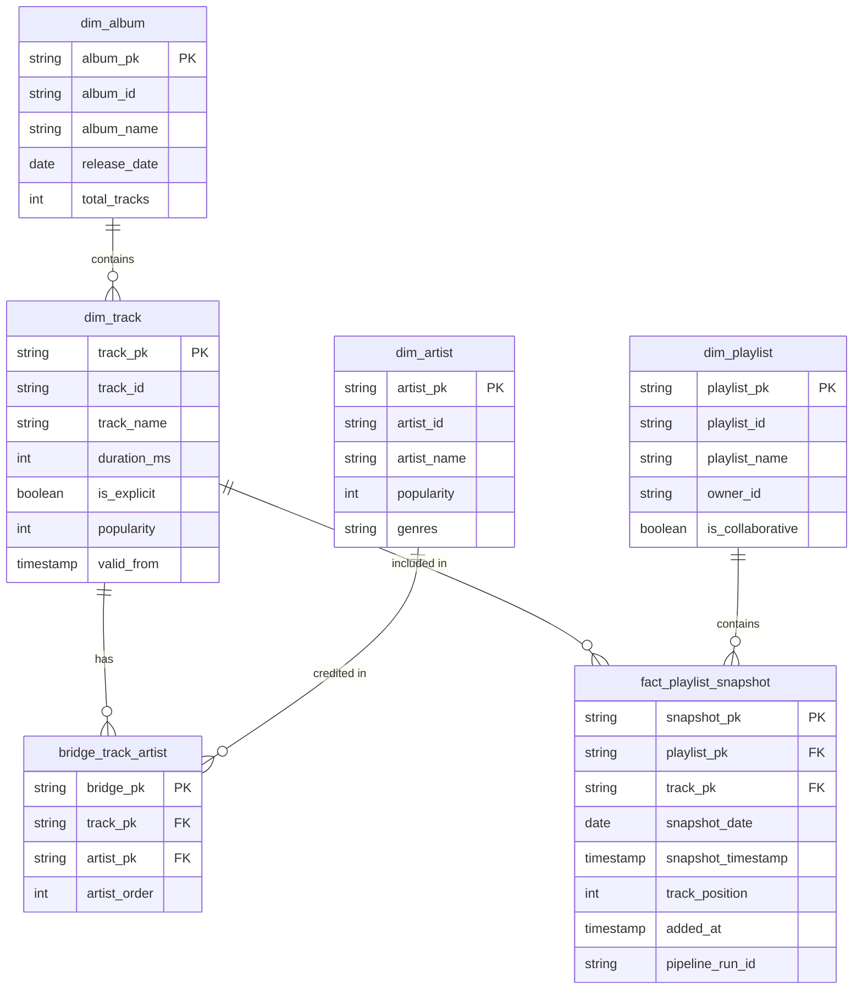

# Spotify Analytics Data Platform — Master Architecture Blueprint

**Version:** 0.1.0
**Status:** Approved / Foundation Phase
**Author:** Daniel Barbosa
**Target Environment:** AWS (us-east-1), Snowflake, Docker, Python 3.12

---

## 1. Executive Summary

The **Spotify Analytics Data Platform** is an enterprise-grade, end-to-end data platform engineered to extract, process, model, and analyze longitudinal Spotify playlist snapshots. Unlike introductory data engineering tutorials that overwrite state daily or collapse ETL logic into monolithic scripts, this platform enforces production standards: strict decoupling between orchestration and execution, immutable data lake storage, distributed Spark transformations for unnesting semi-structured JSON, continuous automated Snowflake ingestion via Snowpipe, Kimball dimensional modeling with dbt Core, automated data testing, and cost-governed infrastructure as code.

---

## 2. Project Objectives

1. **Demonstrate Senior/Staff Engineering Practices**: Implement production-grade architecture, infrastructure as code, CI/CD, modular code, and rigorous documentation suitable for international senior data engineer evaluations.
2. **Longitudinal Analytical Capability**: Ingest and model historical playlist snapshots to measure track longevity, playlist churn, artist concentration, and popularity trajectories over time.
3. **Strict Separation of Concerns**: Maintain Apache Airflow strictly as an orchestrator, AWS Glue/PySpark as the data lake processing engine, Snowflake as the analytical warehouse, and dbt Core as the business modeling tool.
4. **Budget & Cost Governance**: Design the entire infrastructure to operate under a hard ceiling of **$20.00 USD/month**, leveraging serverless architectures, ephemeral execution, and aggressive warehouse auto-suspension.
5. **Zero Trust & Security First**: Zero secrets committed, least-privilege IAM policies, encrypted storage, and automated secret retrieval.

---

## 3. Non-Goals

- **Real-Time Streaming**: This platform does not ingest Kafka/Kinesis streams. Spotify's API does not emit real-time event streams; a batch snapshot cadence (daily/hourly) is the technically appropriate pattern.
- **Over-Engineered Infrastructure**: Kubernetes (EKS), Apache Flink, Apache Hudi, or Databricks are explicitly excluded to prevent unnecessary cost and administrative complexity.
- **Airflow Compute Monolith**: Airflow will not execute data extraction or data transformation in worker memory.
- **Production Commercial SLA**: This is a portfolio demonstration platform; 99.999% high-availability guarantees and multi-region failover are out of scope.

---

## 4. Business Use Cases

1. **Track Churn & Retention Analysis**: Determine the exact entry date, exit date, and duration (days) each track stays in curated playlists (e.g., *Today's Top Hits*, *RapCaviar*).
2. **Artist Market Dominance**: Analyze which record labels and artists maintain the highest recurring presence and track velocity across monitored playlists.
3. **Playlist Volatility Tracking**: Compare stable playlists (low turnover) against volatile discovery playlists (high turnover) to understand curation strategies.
4. **Popularity Trajectory**: Correlate Spotify's internal popularity index (0–100) with playlist inclusion and track longevity.

---

## 5. Engineering Use Cases

1. **Idempotent Data Lake Ingestion**: Safely re-run ingestion pipelines for any historical date without creating duplicate records or corrupting warehouse state.
2. **Schema Drift Quarantine**: Prevent upstream Spotify JSON changes from breaking downstream warehouse queries through explicit PySpark schema enforcement.
3. **Automated Snowpipe Loading**: Ingest partitioned Parquet files into Snowflake within seconds of creation via Amazon S3 event notifications.
4. **Data Contract & Quality Assertion**: Enforce automated testing (not null, uniqueness, referential integrity, range checks) at every stage before publishing to Power BI.

---

## 6. Architecture



---

## 7. Component Responsibilities

| Component | Responsibility | Bound Engine |
| :--- | :--- | :--- |
| **Spotify API** | Source of truth for playlist snapshots, tracks, artists, and albums. | External HTTPS REST |
| **AWS Lambda** | Stateless API client. Handles OAuth2 token exchange, pagination, and lands raw JSON in S3 Bronze. | AWS Lambda (Python 3.12) |
| **Amazon S3** | Durable, multi-tiered object storage (Bronze = Raw JSON, Silver = Parquet, Metadata = Manifests). | AWS S3 Standard |
| **AWS Glue / Spark** | Parses semi-structured JSON, enforces schemas, unpacks arrays, deduplicates, writes partitioned Parquet. | AWS Glue (PySpark 3.3+) |
| **Snowpipe** | Event-driven, serverless ingestion of Silver Parquet files into Snowflake Landing tables. | Snowflake Snowpipe |
| **Snowflake** | High-performance columnar data warehouse executing SQL queries with micro-partitioning. | Snowflake Virtual Warehouse |
| **dbt Core** | Orchestrates warehouse transformations: staging, dimensions, facts, bridge tables, marts, tests. | dbt Core CLI |
| **Apache Airflow** | Orchestrates the end-to-end DAG: triggers Lambda/Glue, waits on sensors, validates ingestion, runs dbt. | Docker Compose / Celery |
| **Power BI** | Business reporting, longitudinal trend visualization, and interactive dashboards. | Power BI Desktop / Service |
| **Terraform** | Declarative infrastructure as code for all AWS resources, IAM roles, and storage integrations. | Terraform CLI |

---

## 8. Data Flow

1. **Extraction (T0)**: Airflow triggers the Lambda extractor with target playlist IDs and a generated `pipeline_run_id`.
2. **Bronze Landing (T0 + 30s)**: Lambda paginates the Spotify API, captures raw responses, and writes them to `s3://<bucket>/bronze/spotify/playlist_tracks/ingestion_date=YYYY-MM-DD/run_id=<run_id>/playlist_<id>.json`.
3. **Silver Transformation (T0 + 60s)**: Airflow triggers the AWS Glue PySpark job. The job reads Bronze JSON, enforces types, explodes nested arrays, normalizes entities (`artists`, `albums`, `tracks`, `track_artists`, `playlist_snapshots`), and writes Snappy-compressed Parquet files to S3 Silver.
4. **Warehouse Landing (T0 + 120s)**: S3 object creation triggers an SQS event consumed by Snowpipe, loading new Parquet partitions into Snowflake `LANDING` tables.
5. **Dimensional Modeling (T0 + 180s)**: Airflow validates row counts in Landing and triggers `dbt build`. dbt updates staging views, incrementally merges core dimensions/facts, and refreshes analytical marts.
6. **Reporting (T0 + 300s)**: Power BI refreshes its cache or executes DirectQuery against Snowflake `MARTS`.

---

## 9. S3 Data Lake Strategy

Target hierarchical layout:
```
s3://<platform-bucket>/
├── bronze/
│   └── spotify/
│       └── playlist_tracks/
│           └── ingestion_date=YYYY-MM-DD/
│               └── run_id=<pipeline_run_id>/
│                   └── playlist_<id>.json
├── silver/
│   ├── artists/
│   │   └── ingestion_date=YYYY-MM-DD/
│   │       └── part-*.parquet
│   ├── albums/
│   │   └── ingestion_date=YYYY-MM-DD/
│   │       └── part-*.parquet
│   ├── tracks/
│   │   └── ingestion_date=YYYY-MM-DD/
│   │       └── part-*.parquet
│   ├── track_artists/
│   │   └── ingestion_date=YYYY-MM-DD/
│   │       └── part-*.parquet
│   └── playlist_snapshots/
│       └── ingestion_date=YYYY-MM-DD/
│           └── part-*.parquet
└── metadata/
    └── pipeline_runs/
        └── year=YYYY/month=MM/
            └── run_<pipeline_run_id>.json
```

---

## 10. File Formats

- **Bronze Layer**: UTF-8 JSON. Preserves 100% of raw API fields, nested hierarchies, and metadata for auditability.
- **Silver Layer**: Apache Parquet with Snappy compression. Columnar, typed, splittable, and optimized for Snowflake ingestion.
- **Metadata Layer**: Line-delimited JSON or JSON manifest files containing execution telemetry.

---

## 11. Partitioning Strategy

- **Bronze**: Hive-style partitioning: `ingestion_date=YYYY-MM-DD/run_id=<run_id>/`. Prevents collisions between retried runs on the same date.
- **Silver**: Hive-style partitioning: `ingestion_date=YYYY-MM-DD/`. Aligns with daily snapshot cadence and enables Snowpipe partition filtering and pruning.
- **Partition Granularity Rationale**: Daily granularity matches the snapshot frequency of Spotify playlists without creating a small-file crisis.

---

## 12. Spotify Extraction Strategy

- **Endpoint**: `/v1/playlists/{playlist_id}/tracks` and `/v1/playlists/{playlist_id}`.
- **Authentication**: OAuth 2.0 Client Credentials flow (`https://accounts.spotify.com/api/token`). Requests an application-level bearer token using `client_id` and `client_secret`.
- **Fields Captured**: Track metadata, duration, explicit flag, popularity, artist IDs, album metadata, release date, and playlist addition timestamps (`added_at`).
- *Note on Source Schema*: Spotify Web API schema fields will be validated against live responses in Milestone M1 before freezing contracts.

---

## 13. API Pagination Strategy

- Spotify limits track retrieval to a maximum of 100 items per request (`limit=100`, `offset=0`).
- The extractor loops through `offset = offset + limit` while `offset < total_tracks`.
- All paginated chunks for a playlist snapshot are consolidated into a single structured extraction document per playlist to maintain atomic snapshot integrity.

---

## 14. Rate-Limit & Error Strategy

- Spotify returns HTTP `429 Too Many Requests` when rate limits are exceeded, accompanied by a `Retry-After` header specifying wait time in seconds.
- The Python HTTP client must implement exponential backoff with jitter and respect the `Retry-After` header.
- Maximum retry attempts: 5. If retries are exhausted, the Lambda execution fails gracefully, logging the failure to CloudWatch and alerting Airflow.

---

## 15. Pipeline Run ID Strategy

- Every pipeline execution generates a deterministic UUID v4 string (`pipeline_run_id`) at the Airflow DAG level.
- This identifier is passed as a parameter to Lambda, written into Bronze directory paths, passed to AWS Glue arguments, embedded into Silver Parquet records, and propagated to Snowflake Landing tables.
- Guarantees complete end-to-end traceability across all services.

---

## 16. Raw-Data Immutability

- S3 Bronze buckets enforce append-only policies.
- Under no circumstances does the extractor update, replace, or mutate existing Bronze files.
- If a pipeline run fails midway or requires re-extraction, a new `run_id` directory is created.

---

## 17. Spark Transformation Strategy

- Implemented in AWS Glue 4.0 (Spark 3.3+ / Python 3.10+).
- Reads Bronze JSON with explicit StructType schemas.
- Uses Spark DataFrame functions (`explode`, `col`, `to_timestamp`, `struct`) to unnest nested items.
- Extracts discrete normalized entities to decouple many-to-many relationships before loading into the warehouse.
- Coalesces output partitions to avoid generating excessive tiny files (target: 1-4 Parquet files per entity partition).

---

## 18. Schema Enforcement

- Downstream ingestion must never rely on Spark's expensive schema inference (`inferSchema=true`).
- All schemas in `glue/schemas/` are explicitly defined using PySpark types (`StringType()`, `IntegerType()`, `BooleanType()`, `TimestampType()`).
- Fields not matching the schema or corrupt records are routed to a rejected/quarantine column or directory for inspection.

---

## 19. Snowflake Ingestion Strategy

- Leverages an external S3 stage backed by an AWS IAM Storage Integration (role-based trust policy, no AWS access keys stored in Snowflake).
- Parquet files are read using Snowflake's native Parquet parser with schema mapping:
  `COPY INTO landing_tracks FROM (SELECT $1:track_id::VARCHAR, ... FROM @silver_stage/tracks/)`

---

## 20. Snowpipe Design

- Configured with `AUTO_INGEST = TRUE`.
- Amazon S3 publishes `s3:ObjectCreated:*` notifications to an Amazon SQS queue managed by Snowflake.
- Snowpipe polls the queue and loads Parquet files into Landing tables as soon as AWS Glue writes them.
- Provides serverless, continuous loading with automatic deduplication based on S3 file path and ETag.

---

## 21. Snowflake Database & Schema Organization

```
SPOTIFY_ANALYTICS (Database)
├── LANDING
│   ├── landing_artists
│   ├── landing_albums
│   ├── landing_tracks
│   ├── landing_track_artists
│   └── landing_playlist_snapshots
├── STAGING (dbt managed views)
│   ├── stg_spotify_artists
│   ├── stg_spotify_albums
│   ├── stg_spotify_tracks
│   ├── stg_spotify_track_artists
│   └── stg_spotify_playlist_snapshots
├── CORE (dbt managed dimensional tables)
│   ├── dim_artist
│   ├── dim_album
│   ├── dim_track
│   ├── dim_playlist
│   ├── bridge_track_artist
│   └── fact_playlist_snapshot
└── MARTS (dbt managed analytical tables / views)
    ├── mart_artist_performance
    ├── mart_playlist_trends
    ├── mart_track_popularity
    └── mart_playlist_changes
```

---

## 22. dbt Architecture

- **Tool**: dbt Core (running inside the orchestration environment or Docker).
- **Adapter**: `dbt-snowflake`.
- **Materialization Strategy**:
  - `staging`: Ephemeral or Views.
  - `core` dimensions: Table (or incremental for high volume).
  - `core` facts: Incremental (keyed on snapshot dates).
  - `marts`: Materialized Tables or dynamic views.
- **Packages**: `dbt-utils` (for surrogate key generation and date spine utilities).

---

## 23. Dimensional Model



---

## 24. Historical Snapshot Model

- Captures the complete state of a playlist at daily intervals.
- Natural Key: `playlist_id` + `track_id` + `track_position` + `snapshot_timestamp`.
- Allows analytical SQL window functions (`LAG() OVER (PARTITION BY playlist_id, track_id ORDER BY snapshot_date)`) to detect:
  - **New Entries**: Track exists on date $T$, but not on date $T-1$.
  - **Exits (Churn)**: Track exists on date $T-1$, but not on date $T$.
  - **Rank Movement**: Change in `track_position` between $T-1$ and $T$.
  - **Tenure**: Cumulative count of distinct snapshot dates a track has appeared.

---

## 25. Incremental Loading Strategy

- **Snowflake Landing**: Append-only via Snowpipe.
- **dbt Staging**: Views over Landing filtered by `_loaded_at >= (select max(_loaded_at) from {{ this }})`.
- **dbt Core Dimensions**: Merged incrementally (`unique_key = 'track_id'`) to update mutable fields (e.g., popularity) while preserving surrogate keys.
- **dbt Core Fact (`fact_playlist_snapshot`)**: Incremental append partitioned by `snapshot_date`.

---

## 26. Idempotency

- Every stage is designed so that re-running a pipeline execution with the same input date produces identical state without duplicate records.
- In Bronze: Scoped by `run_id`.
- In Silver: Output partitions overwritten atomically per `ingestion_date`.
- In Snowflake / dbt: Incremental models use explicit `unique_key` specifications or delete-insert windows.

---

## 27. Deduplication

1. **Spark Tier**: Deduplicates artist and album entities extracted across multiple tracks within the same run.
2. **Landing Tier**: Snowpipe deduplicates S3 files based on S3 ETag and object key.
3. **dbt Tier**: Uses `ROW_NUMBER() OVER (PARTITION BY natural_key ORDER BY ingestion_timestamp DESC)` to eliminate duplicate records during staging.

---

## 28. Retry Strategy

- **Lambda**: Exponential backoff on HTTP 429 and 5xx errors; 5 retry attempts.
- **Airflow Tasks**: Configured with `retries = 3`, `retry_delay = timedelta(minutes=5)`, and `retry_exponential_backoff = True`.
- **Glue**: Configured with `MaxRetries = 1` to prevent runaway compute costs.

---

## 29. Backfill & Reprocessing

- When backfilling historical data or re-running after logic fixes:
  1. Trigger Airflow's backfill DAG with specified start/end date ranges.
  2. Glue reads Bronze JSON partitions corresponding to target dates.
  3. Silver Parquet partitions are regenerated for those dates.
  4. dbt executes with `--select <model> --vars '{"is_backfill": true}'`.

---

## 30. Schema Evolution

- Upstream Spotify API schema changes (e.g., new attributes) do not break the pipeline:
  - Bronze JSON captures new fields automatically without failure.
  - Spark StructType ignores undeclared fields by default, preserving pipeline stability.
  - When new fields are formally adopted, update `glue/schemas/`, add them to Parquet output, update Snowflake Landing DDL, and update dbt models.

---

## 31. Data Quality

The platform enforces quality gates across all layers:
- **Bronze Gates**: File size > 0 bytes, valid JSON parsing.
- **Silver Gates**: Required non-null keys (`track_id`, `artist_id`), `duration_ms > 0`, popularity between 0 and 100.
- **Warehouse Gates (dbt Tests)**:
  - `not_null` and `unique` on all primary and surrogate keys.
  - `relationships` tests enforcing foreign keys between facts, dimensions, and bridge tables.
  - Custom SQL assertions: No future dates in `snapshot_date`, valid track durations.

---

## 32. Observability

Structured telemetry is collected at every stage:
- **Telemetry Schema**:
  ```json
  {
    "pipeline_run_id": "uuid-v4",
    "source": "spotify_web_api",
    "playlist_id": "37i9dQZF1DXcBWIGoYBM5M",
    "ingestion_timestamp": "2026-09-03T12:00:00Z",
    "pipeline_version": "0.1.0",
    "records_extracted": 100,
    "records_validated": 100,
    "records_written_raw": 100,
    "records_written_curated": 100,
    "records_loaded_snowflake": 100,
    "records_rejected": 0,
    "lambda_duration_sec": 4.2,
    "glue_duration_sec": 84.1,
    "dbt_duration_sec": 22.5,
    "total_duration_sec": 110.8,
    "status": "SUCCESS"
  }
  ```
- **Logging Destinations**:
  - Lambda & Glue -> Amazon CloudWatch (JSON structured logs).
  - Airflow -> Task execution logs.
  - Snowflake -> `SNOWFLAKE.ACCOUNT_USAGE.QUERY_HISTORY`.
  - dbt -> `run_results.json` and `sources.json`.

---

## 33. Security

- **Zero Hardcoded Secrets**: Absolutely no secrets in git.
- **Encryption at Rest**: S3 server-side encryption (SSE-S3 or AWS KMS), Snowflake transparent data encryption.
- **Encryption in Transit**: TLS 1.3 enforced for all API, S3, and Snowflake connections.
- **Vulnerability Scanning**: Automated pre-commit checks and GitHub Dependabot alerts.

---

## 34. IAM Philosophy

- **Principle of Least Privilege**: Each service role receives only the exact permissions needed:
  - Lambda Role: `secretsmanager:GetSecretValue` on Spotify credentials, `s3:PutObject` on `s3://<bucket>/bronze/*`.
  - Glue Role: `s3:GetObject` on `bronze/*`, `s3:PutObject` on `silver/*`, CloudWatch logging permissions.
  - Snowflake Storage Integration: Assumes AWS IAM role with `s3:GetObject` and `s3:ListBucket` on `silver/*`.

---

## 35. Secrets Management

- **Local Development**: `.env` file (git-ignored), template documented in `.env.example`.
- **AWS Runtime**: AWS Secrets Manager stores Spotify client credentials.
- **Snowflake**: Key-pair authentication or secure environment variables.
- **GitHub Actions**: Stored in GitHub Repository Secrets.

---

## 36. Terraform Strategy

- All cloud infrastructure defined in `infra/terraform/`.
- Modular layout (`modules/s3`, `modules/iam`, `modules/lambda`, `modules/glue`, `modules/monitoring`).
- State stored locally for development, with S3 + DynamoDB remote backend documented for team environments.
- Enforces tag-based resource governance (`Project = SpotifyAnalyticsDataPlatform`, `Environment = dev`).

---

## 37. CI/CD Strategy

- **GitHub Actions**: Triggers on pull requests and pushes to `main`.
- **Linter**: Ruff (`ruff check .`, `ruff format --check .`).
- **Unit Tests**: pytest executing unit tests and schema assertions.
- **Zero Cloud Deployments in CI**: CI runs tests in mock/dry-run mode without provisioning live AWS or Snowflake infrastructure to prevent cloud costs.

---

## 38. Testing Strategy

- **Unit Tests**: Mocked Spotify API responses, PySpark local tests using mock DataFrames, utility unit tests.
- **Integration Tests**: Verification of S3 object generation and Snowpipe notification payloads.
- **Warehouse Tests**: dbt schema tests, data freshness tests, and domain SQL assertions.

---

## 39. Local Development

- Local virtual environment configured via Python 3.12 and `uv` / `pip`.
- Airflow runs locally via Docker Compose.
- Spark transformations tested locally using lightweight PySpark sessions.
- Fast inner-loop feedback via `make check`.

---

## 40. Cloud Development

- Staging/dev environments deployed via Terraform into dedicated namespaces.
- Runs triggered manually or on a scheduled Airflow instance.
- Teardown executed immediately after verification via `terraform destroy`.

---

## 41. Cost Controls

- Enforces maximum portfolio budget of **$20.00 USD / month**.
- Snowflake `X-Small` warehouse with `AUTO_SUSPEND = 60`.
- CloudWatch log retention capped at 7 days.
- Zero NAT Gateways; zero permanently running EC2/EMR clusters.
- AWS Budgets configured with alerts at $10.00 and $18.00.

---

## 42. Failure Scenarios

1. **Spotify API Downtime / HTTP 5xx**: Lambda retries with exponential backoff; if persistent, fails cleanly and alerts Airflow.
2. **Schema Drift in API Payload**: Unrecognized fields pass into Bronze JSON; Glue StructType ignores unmapped fields; alerts generated if required fields are missing.
3. **Snowpipe Ingestion Stall**: SQS backlog builds; Airflow sensor detects missing rows in Landing and halts downstream dbt execution before corruption occurs.
4. **dbt Test Assertion Failure**: dbt halts execution, preventing bad data from materializing into `MARTS`.

---

## 43. Recovery Scenarios

1. **Reprocessing Corrupt Day**: Delete target date partition in S3 Silver, re-run Glue for target date, let Snowpipe re-ingest, and run `dbt run --select +stg_spotify_tracks`.
2. **Disaster Recovery**: Re-run Glue ETL over S3 Bronze history to rebuild Silver and Snowflake warehouses from scratch without calling Spotify API.

---

## 44. Definition of Done

A pipeline feature or milestone is complete when:
1. Production code is written, typed, and formatted per PEP 8 / Ruff.
2. Unit tests achieve > 90% coverage on new logic and pass in CI.
3. Documentation, data dictionary, and ADRs are updated.
4. Local execution via `make check` succeeds with exit code 0.
5. Zero secrets committed; zero unbudgeted cloud resources left running.

---

## 45. Portfolio & Demo Strategy

- Public GitHub repository with comprehensive README and architecture diagrams.
- Clean Git commit history using Conventional Commits.
- Realistic mock data and reproducible demonstration scripts for hiring managers.
- Clear demonstration of cost-aware, production-grade enterprise design patterns.

---

## 46. Interview Talking Points

- **Why both Spark and dbt?** Spark handles high-scale semi-structured array explosion and Parquet serialization at low DPU cost; dbt handles modular SQL dimensional modeling and warehouse analytics.
- **Why Airflow as orchestrator only?** Prevents OOM failures, decouples compute scaling from scheduling, and enables zero-cost local Airflow development.
- **Why historical snapshots?** Enables longitudinal churn, track tenure, and volatility metrics that overwrite pipelines cannot answer.
- **How is cost controlled?** Strict serverless architecture, 60-second Snowflake auto-suspend, and no always-on infrastructure.

---

## 47. Future Improvements

- Migrate S3 Silver Parquet to **Apache Iceberg** tables to demonstrate open table format capabilities.
- Integrate **Great Expectations** or **Soda Core** for enhanced cross-pipeline data contract validation.
- Implement automated Terraform CI deployment via GitHub Actions environments.
