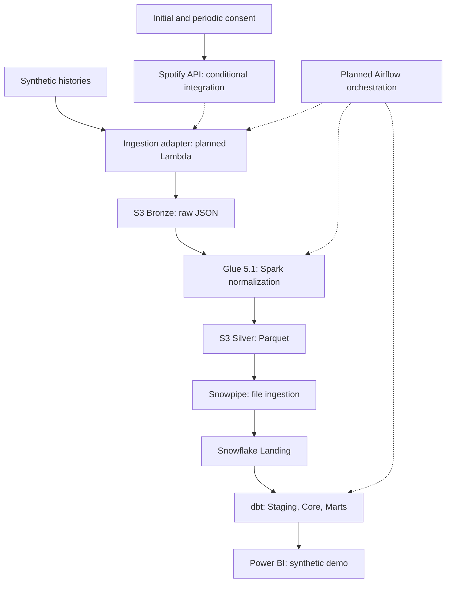

# Spotify Analytics Data Platform — Master Architecture Blueprint

**Architecture baseline:** v0.1.1
**Documentation revision:** 2026-09-09 (Issue #42; no new release tag)
**Status:** M1 Complete / Issues #1–#4 Implemented
**Author:** Daniel Barbosa
**Target Environment:** AWS (us-east-1), Snowflake, Docker, Python 3.12, AWS Glue 5.1, Apache Airflow 3.x

---

## 1. Executive Summary

The **Spotify Analytics Data Platform** is a portfolio-scale Data Engineering
project with an offline-tested authentication client, paginated extractor,
synthetic fixtures/parser, validated run-lineage metadata, and immutable local
Bronze persistence. The cloud lake, Spark transformations, warehouse, dbt models,
orchestration, and BI described below are a target design, not deployed components
or proven production behavior.

Portfolio analytics uses fully synthetic playlist histories under
[ADR-0008](adr/0008-synthetic-analytics-and-source-use-boundary.md). Live analytical
use of Spotify data remains unresolved; API consent alone does not establish
permission. A synthetic end-to-end runner remains future work.

Version 0.1.1 formally aligns the platform with the 2026 Spotify Web API specifications, AWS Glue 5.1 runtimes, Apache Airflow 3.x architecture, and mathematically sound canonical fact grain modeling.

---

## 2. Project Objectives

1. **Demonstrate Data Engineering Judgment**: Build modular code, meaningful tests, explicit contracts, and incremental infrastructure definitions that can be explained in international technical interviews.
2. **Longitudinal Analytical Capability**: Ingest and model historical playlist snapshots to measure track longevity, playlist churn, artist concentration, position movement, and composition shifts over time across fully synthetic playlist histories.
3. **Strict Separation of Concerns**: Maintain Apache Airflow 3.x strictly as an orchestrator, AWS Glue 5.1/PySpark as the data lake processing engine, Snowflake as the analytical warehouse, and dbt Core as the business modeling tool.
4. **Budget & Cost Governance**: Design the entire infrastructure around an operational portfolio budget target of **$20.00 USD/month**, leveraging serverless architectures, ephemeral execution, and aggressive warehouse auto-suspension.
5. **Secure Credential Architecture**: Zero secrets committed, OAuth 2.0 Authorization Code flow with refresh token persistence in AWS Secrets Manager, least-privilege IAM policies, and encrypted storage.

---

## 3. Non-Goals

- **Real-Time Streaming**: This platform does not ingest Kafka/Kinesis streams. Spotify's API does not emit real-time event streams; a batch snapshot cadence (daily/hourly) is the technically appropriate pattern.
- **Arbitrary Global Editorial Scraping**: The platform does not claim or attempt unsupported scraping of arbitrary public Spotify editorial playlists without authorized access. The items endpoint requires the authorized user to own the playlist or be a collaborator; following a playlist alone is insufficient. Permitted use remains a separate requirement.
- **Over-Engineered Infrastructure**: Kubernetes (EKS), Apache Flink, or Databricks are explicitly excluded to prevent unnecessary cost and administrative complexity.
- **Airflow Compute Monolith**: Airflow will not execute data extraction or data transformation in worker memory.
- **Production Commercial SLA**: This is a portfolio demonstration platform; 99.999% high-availability guarantees and multi-region failover are out of scope.

---

## 4. Business Use Cases

1. **Track Churn & Retention Analysis**: Determine observed entries, exits, and retention across synthetic daily observations; do not infer exact changes between captures.
2. **Artist Concentration & Representation**: Analyze which artists occupy the greatest share of playlist real estate and how artist representation shifts over months.
3. **Playlist Volatility Tracking**: Quantify turnover rates (daily additions vs. removals) across monitored playlists to evaluate curation dynamics.
4. **Positional Trajectory**: Track daily chart and rank movement, measuring best position achieved and average position over a song's lifecycle.
5. **Composition Evolution**: Observe longitudinal changes in explicit content share, track duration distribution, and release recency (catalog age).

---

## 5. Engineering Use Cases

1. **Idempotent Data Lake Ingestion**: Safely re-run ingestion pipelines for any historical date without creating duplicate records or corrupting warehouse state.
2. **Schema Drift Quarantine**: Prevent upstream Spotify JSON changes from breaking downstream warehouse queries through explicit PySpark schema enforcement and item-type validation.
3. **Automated Snowpipe Loading**: Ingest partitioned Parquet files into Snowflake after creation, with latency to be measured via Amazon S3 event notifications.
4. **Deterministic Merge Backfills**: Enable arbitrary historical backfills and retries using dbt SQL `MERGE` on a canonical composite unique key.
5. **Source Version Tracking**: Track upstream playlist mutations via Spotify's native `snapshot_id`.

---

## 6. Architecture



---

## 7. Component Responsibilities

| Component | Responsibility | Bound Engine |
| :--- | :--- | :--- |
| **Spotify API** | Source of truth for playlist snapshots, items, tracks, artists, and albums. | External HTTPS REST |
| **AWS Secrets Manager** | Secure vault storing `client_id`, `client_secret`, and long-lived `refresh_token`. | AWS Secrets Manager |
| **AWS Lambda** | Serverless extractor. Exchanges refresh token for short-lived access token, paginates `/items`, and lands raw JSON in S3 Bronze. | AWS Lambda (Python 3.12) |
| **Amazon S3** | Durable, multi-tiered object storage (Bronze = Raw JSON, Silver = Parquet, Metadata = Manifests). | AWS S3 Standard |
| **AWS Glue 5.1** | Parses semi-structured JSON, enforces schemas, validates item types, explodes arrays, deduplicates, writes partitioned Parquet. | Apache Spark 3.5.6 / Python 3.11 |
| **Snowpipe** | Event-driven, serverless continuous ingestion of Silver Parquet files into Snowflake Landing tables. | Snowflake Snowpipe |
| **Snowflake** | High-performance columnar data warehouse executing SQL queries with micro-partitioning. | Snowflake Virtual Warehouse (`X-Small`) |
| **dbt Core** | Orchestrates warehouse transformations: staging, dimensions, incremental facts, bridge tables, marts, tests. | dbt Core CLI |
| **Apache Airflow 3.x** | Orchestrates end-to-end workflow: triggers Lambda/Glue, coordinates sensors, validates ingestion, runs dbt. | Docker Compose / Task SDK |
| **Power BI** | Business reporting, longitudinal trend visualization, churn metrics, and interactive dashboards. | Power BI Desktop / Service |
| **Terraform** | Declarative infrastructure as code for AWS resources, IAM roles, and storage integrations. | Terraform CLI |

---

## 8. Planned Data Flow

The API/auth steps describe only the conditional integration. The synthetic demo
will supply invented observations without Spotify credentials; its adapter remains
to be implemented. Downstream processing is the same planned design.

1. **Extraction**: Airflow triggers the Lambda extractor with target playlist IDs, `snapshot_date`, and generated physical `pipeline_run_id`.
2. **Token Refresh & Bronze Landing**: Lambda retrieves the refresh token from Secrets Manager, obtains a short-lived access token from Spotify Accounts, paginates `GET /v1/playlists/{id}/items` (limit=50), captures `spotify_snapshot_id`, and writes raw JSON to `s3://<bucket>/bronze/spotify/playlist_tracks/ingestion_date=YYYY-MM-DD/run_id=<run_id>/playlist_<id>.json`.
3. **Silver Transformation**: Airflow triggers the AWS Glue 5.1 PySpark job. The job reads Bronze JSON, enforces explicit StructType schemas, validates item types (extracting tracks and quarantining non-tracks), explodes artist relationships, deduplicates entities, and writes Snappy Parquet to S3 Silver partitioned by `ingestion_date`.
4. **Warehouse Landing**: S3 object creation triggers an SQS event consumed by Snowpipe, loading Parquet partitions into Snowflake `LANDING` tables along with file audit metadata (`METADATA$FILENAME`, `METADATA$FILE_ROW_NUMBER`).
5. **Dimensional Modeling**: Airflow validates row counts in Landing and triggers `dbt build`. dbt updates staging views, incrementally merges core dimensions, merges `fact_playlist_snapshot` on `snapshot_pk`, and refreshes analytical marts.
6. **Reporting**: Power BI queries curated models in Snowflake `MARTS`.

---

## 9. S3 Data Lake Strategy

```
s3://<platform-bucket>/
├── bronze/
│   └── spotify/
│       └── playlist_tracks/
│           └── ingestion_date=YYYY-MM-DD/
│               └── run_id=<pipeline_run_id>/
│                   └── playlist_<id>.json
├── silver/
│   ├── artists/
│   │   └── ingestion_date=YYYY-MM-DD/
│   │       └── part-*.parquet
│   ├── albums/
│   │   └── ingestion_date=YYYY-MM-DD/
│   │       └── part-*.parquet
│   ├── tracks/
│   │   └── ingestion_date=YYYY-MM-DD/
│   │       └── part-*.parquet
│   ├── track_artists/
│   │   └── ingestion_date=YYYY-MM-DD/
│   │       └── part-*.parquet
│   └── playlist_snapshots/
│       └── ingestion_date=YYYY-MM-DD/
│           └── part-*.parquet
└── metadata/
    └── pipeline_runs/
        └── year=YYYY/month=MM/
            └── run_<pipeline_run_id>.json
```

---

## 10. File Formats

- **Bronze Layer**: UTF-8 JSON. Preserves decoded JSON bodies, nested values, order, nulls, and unknown fields. The current extractor returns metadata, pages, and consolidated items; response headers and original wire bytes are not persisted.
- **Silver Layer**: Apache Parquet with Snappy compression. Columnar, strictly typed, splittable, and optimized for Snowflake ingestion.
- **Metadata Layer**: JSON execution manifests documenting run telemetry and audit metrics.

---

## 11. Partitioning Strategy

- **Bronze**: Partitioned by `ingestion_date=YYYY-MM-DD/run_id=<pipeline_run_id>/`. Isolates individual execution payloads and prevents collision during retries.
- **Silver**: Partitioned by `ingestion_date=YYYY-MM-DD/`. Aligns with daily snapshot cadence and enables partition pruning in Snowflake external stages.

---

## 12. Spotify Extraction Strategy

- **Endpoint**: `/v1/playlists/{playlist_id}/items`.
- **Authentication**: Authorization Code with periodic reauthorization per ADR-0007. Refresh tokens last six months from authorization; routine access-token refresh does not renew that period. The local client handles `invalid_grant`; browser setup, durable token storage, and expiry alerts remain planned.
- **Scopes**: `playlist-read-private`, `playlist-read-collaborative`.
- **Source Lineage**: Captures `spotify_snapshot_id` returned on the playlist response.

---

## 13. API Pagination Strategy

- Under Spotify Web API specifications for `/v1/playlists/{id}/items`, the maximum `limit` is **50 items per request**.
- The client initializes with `limit=50`, `offset=0`, advances by the actual item count, and validates that `total` and `next` agree before returning a complete result.
- The items response does not contain `snapshot_id`. The client reads playlist metadata before pagination and checks `GET /v1/playlists/{id}?fields=snapshot_id` after every page. An observed version change aborts the entire extraction; this is optimistic validation, not a pinned server-side transaction.
- See [Local Ingestion](LOCAL_INGESTION.md) for the implemented raw payload contract, request limits, and retry behavior.

---

## 14. Rate-Limit & Error Strategy

- Spotify emits HTTP `429 Too Many Requests` when throttled, including a `Retry-After` header.
- The Python client implements exponential backoff with jitter respecting the `Retry-After` value.
- Maximum retry limit: 5 retries after the initial attempt per API request. Exhausted HTTP 429 responses raise `RateLimitExceededException`; the future Lambda/Airflow adapters will report and handle that failure.

---

## 15. Pipeline Run ID Strategy

- `pipeline_run_id` is a **UUID v4** generated per Airflow DAG run.
- It is **intentionally non-deterministic** and serves strictly as a physical execution tracking identifier.
- Business observation identity is defined by `snapshot_date` (calendar date) and upstream `spotify_snapshot_id`.
- Retries of the same business date receive new physical `pipeline_run_id` values but merge idempotently into the same canonical warehouse keys.

---

## 16. Raw-Data Immutability

- S3 Bronze is append-only.
- Raw files are never overwritten, edited, or deleted in place during normal pipeline runs.
- Reprocessed runs land in a new `run_id` subdirectory.

---

## 17. Spark Transformation Strategy

- Planned for **AWS Glue 5.1**, Apache Spark 3.5.6 and Python 3.11. Keep this environment separate from the local Python >=3.12 package; shared code requires explicit runtime compatibility validation.
- Ingests raw Bronze JSON using explicit `StructType` schemas.
- Validates item structure: checks the wrapper's `item.type` (`track` or `episode`), extracting supported music tracks and quarantining non-track items.
- Explodes nested artist arrays to produce normalized `tracks` and `track_artists` datasets.
- Coalesces output partitions to avoid tiny-file fragmentation.

---

## 18. Schema Enforcement

- Schema inference (`inferSchema=true`) is strictly prohibited in production Spark jobs.
- Schemas are defined in `glue/schemas/` using explicit PySpark types.
- Unsupported or malformed records are routed to `_corrupt_record` handling.
- Note: Per 2026 Spotify API updates, deprecated popularity and label fields are excluded.

---

## 19. Snowflake Ingestion Strategy

- Leverages an external S3 stage backed by an AWS IAM Storage Integration.
- Snowpipe parses Parquet files into Landing tables using explicit column mappings and captures audit columns:
  `_loaded_at`, `_file_name` (`METADATA$FILENAME`), `_file_row_number` (`METADATA$FILE_ROW_NUMBER`).

---

## 20. Snowpipe Design

- Configured with `AUTO_INGEST = TRUE` via Amazon SQS notifications.
- **Idempotency Clarification**: Snowpipe tracks loaded files subject to its load-history semantics. This is separate from business deduplication, which is planned in dbt through canonical keys and controlled merge/replay behavior.

---

## 21. Snowflake Database & Schema Organization

```
SPOTIFY_ANALYTICS (Database)
├── LANDING
│   ├── landing_artists
│   ├── landing_albums
│   ├── landing_tracks
│   ├── landing_track_artists
│   └── landing_playlist_snapshots
├── STAGING (dbt managed views)
│   ├── stg_spotify_artists
│   ├── stg_spotify_albums
│   ├── stg_spotify_tracks
│   ├── stg_spotify_track_artists
│   └── stg_spotify_playlist_snapshots
├── CORE (dbt managed dimensional tables)
│   ├── dim_artist
│   ├── dim_album
│   ├── dim_track
│   ├── dim_playlist
│   ├── bridge_track_artist
│   └── fact_playlist_snapshot
└── MARTS (dbt managed analytical tables / views)
    ├── mart_artist_presence
    ├── mart_playlist_trends
    ├── mart_track_lifecycle
    └── mart_playlist_changes
```

---

## 22. dbt Architecture

- **Tool**: dbt Core.
- **Adapter**: `dbt-snowflake`.
- **Materializations**:
  - `staging`: Views.
  - `core` dimensions: Table (incremental merge for dimensions).
  - `core` fact (`fact_playlist_snapshot`): Incremental with `incremental_strategy = 'merge'`.
  - `marts`: Tables.
- **Packages**: `dbt-labs/dbt_utils`.

---

## 23. Dimensional Model

Refer to [`docs/DATA_MODEL.md`](DATA_MODEL.md) for full ERD and schema dictionaries. Core entities include:
- `dim_track`: Track attributes, surrogate key `track_pk`.
- `dim_artist`: Artist attributes, surrogate key `artist_pk`.
- `dim_album`: Album metadata, surrogate key `album_pk`.
- `dim_playlist`: Playlist metadata, surrogate key `playlist_pk`.
- `bridge_track_artist`: Resolves many-to-many track/artist billing, surrogate key `bridge_pk`.
- `fact_playlist_snapshot`: Historical snapshot fact, surrogate key `snapshot_pk`.

---

## 24. Historical Snapshot Model

- **Canonical Grain**: `playlist_id` + `snapshot_date` + `track_position`.
  *(One canonical position slot per playlist per business observation date).*
- The `track_id` is the observed dimensional entity occupying that slot on that date.
- Surrogate Key: `snapshot_pk = hash(playlist_id || '-' || snapshot_date || '-' || track_position)`.
- Lineage Attributes: `spotify_snapshot_id`, `pipeline_run_id`, `snapshot_timestamp`, `added_at`.

---

## 25. Incremental Loading Strategy

- The dbt fact model uses `incremental_strategy = 'merge'` on `unique_key = 'snapshot_pk'`.
- **Normal Run**: Processes the specified `snapshot_date`.
- **Backfill Run**: Accepts explicit start and end date variables:
  `dbt build --select fact_playlist_snapshot --vars '{"start_date": "YYYY-MM-DD", "end_date": "YYYY-MM-DD"}'`.
- **Retry**: Re-running an existing date updates/matches the canonical slot records rather than duplicating them.

---

## 26. Idempotency

Idempotency is a layer-specific design goal; it is not yet validated end-to-end:
- Bronze: M1 validates local append-only/no-clobber publication scoped by physical
  `run_id`; the equivalent S3 persistence boundary remains M2 work.
- Silver: partition publication/replacement semantics remain to be implemented;
  multiple object writes must not be described as an atomic S3 transaction.
- Snowflake: planned merge on deterministic business keys. M5 must define the
  canonical observation per date and removal of obsolete slots when replacing a
  snapshot with fewer items, including empty playlists.

Historical replay requires previously captured Bronze data. A fresh API call
cannot reconstruct an unobserved past playlist by assigning it an older date.

---

## 27. Deduplication

1. **Spark Tier**: Deduplicates artist and album entities extracted across multiple tracks within the run batch.
2. **Staging Tier**: Uses `ROW_NUMBER() OVER (PARTITION BY ... ORDER BY _loaded_at DESC)` to isolate the most recent landing record per slot.
3. **Core Tier**: Planned dbt merge uses `snapshot_pk`; source uniqueness, canonical-run selection, and obsolete-slot handling require implementation and tests.

---

## 28. Retry Strategy

- **Lambda**: Exponential backoff on HTTP 429 and 5xx; 5 retry attempts.
- **Airflow 3**: Task retries with exponential backoff; Deadline Alerts for SLA monitoring.
- **Glue**: Configured with `MaxRetries = 1` to prevent runaway compute costs.

---

## 29. Backfill & Reprocessing

To reprocess historical data:
1. Verify raw JSON exists in S3 Bronze for target dates.
2. Re-run Glue 5.1 ETL for target dates to rebuild Silver Parquet.
3. Allow Snowpipe to ingest or execute manual copy.
4. Execute `dbt build` with explicit backfill date ranges.

---

## 30. Schema Evolution

- Upstream Spotify API schema changes:
  - Bronze JSON captures new fields automatically without failure.
  - PySpark explicit `StructType` ignores unmapped attributes, maintaining pipeline stability.
  - New attributes are formally adopted by updating schemas, Parquet output, and dbt models in a controlled release.

---

## 31. Data Quality

Cross-tier validation gates:
- **Bronze Gates**: File size > 0 bytes, valid JSON structure, non-empty payload.
- **Silver Gates**: Required non-null keys (`track_id`, `artist_id`), positive track durations (`duration_ms > 0`).
- **Warehouse Gates (dbt Tests)**:
  - `not_null` and `unique` on all primary and surrogate keys.
  - `relationships` tests enforcing foreign keys between facts, dimensions, and bridge tables.
  - Custom SQL assertions: Valid date bounds, positive durations.

---

## 32. Observability

Structured JSON telemetry captures execution and version metadata:
- Execution Lineage: `pipeline_run_id` (UUID v4), `snapshot_date`, `snapshot_timestamp`.
- Upstream Version: `spotify_snapshot_id`.
- Metrics: Records extracted, validated, written raw, written curated, loaded snowflake, rejected, and tier durations.
- Destination: CloudWatch Logs (Lambda & Glue), Airflow task logs, Snowflake `COPY_HISTORY`, and dbt run artifacts.

---

## 33. Security

- Zero hardcoded secrets in version control.
- OAuth 2.0 Authorization Code Flow with Refresh Token stored in AWS Secrets Manager.
- Short-lived operational access tokens (1 hour).
- Planned encryption at rest (SSE-S3 / KMS, Snowflake-managed encryption) and secure TLS in transit. The local transport verifies certificates; no negotiated TLS version has been measured.

---

## 34. IAM Philosophy

- Principle of Least Privilege:
  - Lambda Role: `secretsmanager:GetSecretValue` on `spotify/api/credentials`, `s3:PutObject` on `bronze/*`.
  - Glue Role: `s3:GetObject` on `bronze/*`, `s3:PutObject` on `silver/*`, CloudWatch logs.
  - Snowflake Integration: Read-only cross-account role on `silver/*`.

---

## 35. Secrets Management

- Local: `.env` (gitignored), template in `.env.example` using `AWS_PROFILE=spotify-dev`.
- AWS: AWS Secrets Manager.
- Snowflake: Dedicated service roles (`SPOTIFY_TRANSFORMER`, `SPOTIFY_LOADER`), never `SYSADMIN`.

---

## 36. Terraform Strategy

- Future cloud resources will be defined in `infra/terraform/`; it currently contains only a design README.
- Modular layout (`modules/s3`, `modules/iam`, `modules/lambda`, `modules/glue`, `modules/monitoring`).
- Terraform validation/planning in CI is future M8 work. Cloud deployment requires explicit owner authorization.

---

## 37. CI/CD Strategy

- GitHub Actions executes static checks on pull requests and pushes to `main`.
- Tools: Ruff (`ruff check .`, `ruff format --check .`), pytest (`pytest`).
- Tests require no cloud credentials and block network calls. CI checkout and dependency installation still use the network.

---

## 38. Testing Strategy

- Unit Tests: Offline tests using synthetic Spotify 2026 JSON fixtures.
- Planned M3 tests: Local SparkSession validating unnesting and schema enforcement.
- Planned M5 tests: dbt schema assertions and singular SQL tests.

---

## 39. Local Development

- Local Python 3.12 virtualenv managed via `uv` or `pip`.
- Future Airflow environment targets >=3.1,<4 because Deadline Alerts start in 3.1; exact runtime and provider versions will be pinned in M6. No Compose environment exists yet.
- Validated run-lineage metadata and immutable local Bronze JSON persistence mirror
  the future S3 object hierarchy under the gitignored `data/` directory.
- Fast inner-loop feedback via `make check`.

---

## 40. Cloud Development

- Future authorized deployments target `us-east-1`, after Terraform implementation.
- Review teardown scope and verify resources and billing afterward; no destroy workflow is currently implemented.

---

## 41. Cost Controls

- Portfolio budget target: **≤ $20.00 USD / month** (operational alert threshold).
- Verify current pricing and account-specific credits/Free Tier eligibility before deployment; no allowance or zero-cost outcome is assumed.
- Snowflake `X-Small` warehouse with `AUTO_SUSPEND = 60`.
- Planned CloudWatch log retention: 7 days; retention does not eliminate ingestion/storage charges.
- Zero always-on compute (no MWAA, no NAT Gateways, no EMR).

---

## 42. Failure Scenarios

1. **Token Invalidation / Expiration**: The local client raises `InvalidGrantException` for `invalid_grant`; future cloud adapters must emit a sanitized operator notification. No alert is implemented today.
2. **API Rate Limiting (429)**: Backoff with jitter respecting `Retry-After`.
3. **Mid-Pagination Playlist Mutation**: A changed metadata `snapshot_id` raises `SnapshotChangedException` without returning a partial result. The caller must restart the whole read. This is optimistic validation, not a pinned or atomic server-side snapshot; restart is not automatic in the current extractor.
4. **dbt Test Assertion Failure**: Pipeline halts, preventing bad data from materializing in `MARTS`.

---

## 43. Recovery Scenarios

1. **Token Reauthorization**: Operator repeats consent after expiry/revocation. No setup utility or Secrets Manager persistence adapter is implemented yet; follow ADR-0007 and the local runbook boundary.
2. **Historical Backfill**: Re-run Glue ETL over Bronze history, followed by dbt merge backfill.
3. **Partition Purge**: Delete target Silver partition and re-trigger pipeline for that date.

---

## 44. Definition of Done

A pipeline feature is complete when:
1. Code adheres to PEP 8 / Ruff.
2. Unit tests achieve > 90% coverage on new logic.
3. Documentation and ADRs reflect current implementation.
4. `make check` passes with exit code 0.
5. Zero secrets committed; zero unbudgeted cloud resources left running.

---

## 45. Portfolio & Demo Strategy

- Public GitHub repository with clean Git history and architectural rigor.
- Realistic mock fixtures and reproducible demonstration workflows.
- Professional engineering communication avoiding tutorial tropes.

---

## 46. Interview Talking Points

- **Why Authorization Code + Refresh Token instead of Client Credentials?** Client Credentials lacks user scope context and cannot access private/collaborative playlists under modern Spotify Development Mode constraints.
- **Why snapshot_id vs. pipeline_run_id?** `pipeline_run_id` tracks physical pipeline execution lineage; `spotify_snapshot_id` tracks upstream state versioning.
- **Why is the canonical fact grain playlist_id + snapshot_date + track_position?** Decouples observation identity from physical run timestamps, ensuring deterministic merge idempotency across retries and backfills.
- **Why Spark and dbt?** Spark handles semi-structured array explosion and Parquet serialization on low-cost Glue DPUs; dbt handles modular SQL dimensional modeling and warehouse analytics.
- **How is cost controlled?** Ephemeral serverless execution, 60-second Snowflake auto-suspension, and zero always-on infrastructure.

---

## 47. Future Improvements

- Evaluate **Apache Iceberg** tables on S3 Silver for open-table-format time travel.
- Implement **Soda Core** or **Great Expectations** for advanced cross-tier data contracts.
- Automated OIDC-based GitHub Actions deployment.
